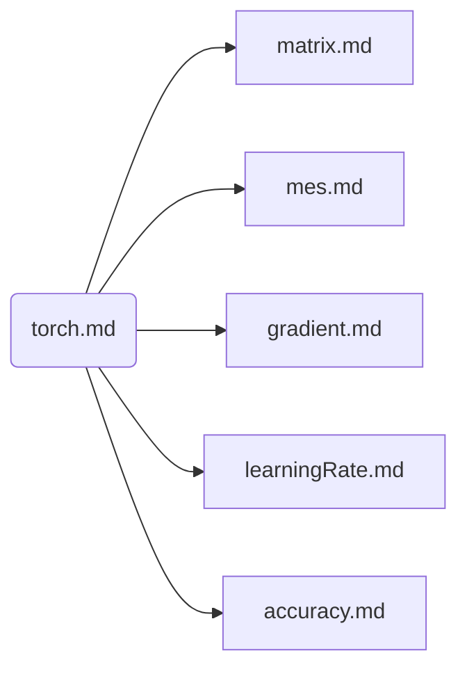

<h1>Documents of This Projects</h1>

* [GRU Forecast Model](gru/doc/gru.md)
* [Understand pytorch module](doc/torch.md)
* [Document of Stock Project](doc/stock.md)
  

* [Understand basic operation on matrix](doc/matrix.md)
* [Understand Mean Square Error](doc/mse.md)
* [Understand Gradient Descending](doc/gradient.md)
* [Understand Learning Rate](doc/learningRate.md)
* [Understand Accuracy](doc/accuracy.md)