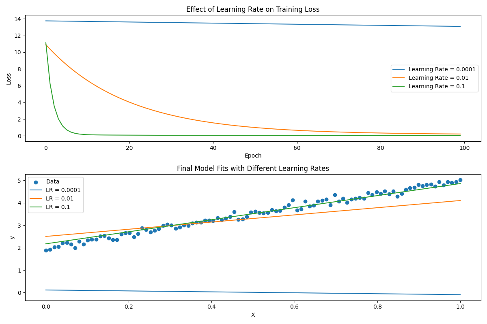

The learning rate in a neural network (NN) is a hyperparameter that controls how much to change the model in response to the estimated error each time the model weights are updated. It determines the step size at each iteration while moving toward a minimum of the loss function.

Here's a more detailed explanation:

1. **Gradient Descent**: Neural networks are trained using an optimization algorithm called gradient descent. The objective is to minimize the loss function, which measures how well the model's predictions match the actual data.
[Gradient Descent](gradient.md)

2. **Updating Weights**: During training, the model's weights are adjusted based on the gradients of the loss function with respect to the weights. These gradients indicate the direction and magnitude of the steepest ascent in the loss function. To minimize the loss, the weights are updated in the opposite direction.

3. **Role of Learning Rate**: The learning rate controls the size of these updates. A higher learning rate means larger updates, while a lower learning rate means smaller updates.

   - **High Learning Rate**: If the learning rate is too high, the model might overshoot the optimal solution, causing it to diverge or oscillate.
   - **Low Learning Rate**: If the learning rate is too low, the model will converge very slowly, potentially getting stuck in local minima and taking a long time to reach the optimal solution.

4. **Choosing the Learning Rate**: Selecting the right learning rate is crucial for efficient training. It often requires experimentation and tuning. Some advanced techniques, like learning rate schedules and adaptive learning rate methods (e.g., Adam, RMSprop), can help automatically adjust the learning rate during training.

In summary, the learning rate is a key parameter in the training process of a neural network, influencing how quickly and effectively the model learns from the data.

The learning rate is a hyperparameter in machine learning and optimization algorithms that controls the size of the steps taken during the gradient descent process. It determines how quickly or slowly a model learns by adjusting its weights during training. The learning rate is denoted by \(\eta\) or \(\alpha\).

### Key Concepts:

1. **Gradient Descent**:
   - Gradient descent is an optimization algorithm used to minimize the loss function of a neural network or machine learning model.
   - During each iteration of gradient descent, the model's weights are updated in the opposite direction of the gradient of the loss function with respect to the weights.

2. **Learning Rate (\(\eta\))**:
   - The learning rate controls the size of the steps taken during each update:
     \[
     w_{t+1} = w_t - \eta \nabla L(w_t)
     \]
     where \( w_t \) are the weights at iteration \( t \), \(\eta\) is the learning rate, and \(\nabla L(w_t)\) is the gradient of the loss function with respect to the weights.
$L(w_t)$ is Loss function (MSE, Entropy,...)
$\nabla L(w_t)$ is the gradient of Loss function respect to weight at iteration t.

3. **Choosing the Right Learning Rate**:
   - **Too High**: If the learning rate is too high, the model may take large steps that cause it to overshoot the minimum of the loss function, leading to divergent behavior and unstable training.
   - **Too Low**: If the learning rate is too low, the model will take very small steps, making the training process slow and potentially getting stuck in local minima.

4. **Learning Rate Schedules and Adaptive Learning Rates**:
   - **Learning Rate Schedules**: The learning rate can be adjusted during training using predefined schedules (e.g., reducing the learning rate after a certain number of epochs).
   - **Adaptive Learning Rates**: Optimizers like Adam, RMSprop, and Adagrad adjust the learning rate for each parameter dynamically based on past gradients.

### Practical Example in PyTorch:

Here’s a simple example demonstrating the impact of the learning rate on gradient descent using PyTorch:

[👍😄Understand learning rate by sin(x)](../src/learningRate.py)

$$f(x)=(x-2)^2$$
$$f'(x)=\frac {df} {dx}=\frac {df} {du}\frac {du} {dx}=2u \cdot 1 = 2(x-2)$$
where $u(x)=x2$
[Understand learning rate by (x-2)^2](../src/learningRate1.py)

### Explanation of the Example:

1. **Function Definition**:
   - The function \( f(x) = (x - 2)^2 \) is defined. The minimum of this function is at \( x = 2 \).

2. **Gradient Descent Function**:
   - The `gradient_descent` function performs gradient descent for a given initial value, learning rate, and number of iterations.
   - In each iteration, the loss is computed, the gradient is calculated, and the variable `x` is updated using gradient descent.

3. **Testing Different Learning Rates**:
   - The script tests gradient descent with different learning rates (0.01, 0.1, and 0.5) and prints the results.

By running this script, you can observe how different learning rates affect the convergence of the gradient descent algorithm. The goal is to find a learning rate that allows the model to converge quickly and stably to the minimum of the loss function.

[Understand learning rate by (x-2)^2](../src/learningRate2.py)
