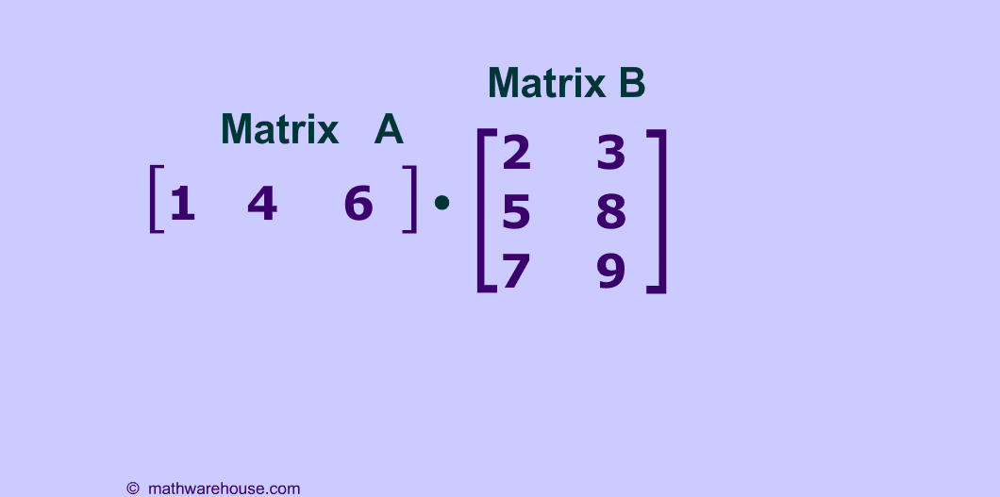

## 鸡兔同笼

[矩阵乘法](https://www.youtube.com/watch?v=1hf_cHNbgCk)

❓📌 为什么在矩阵相乘时，需要**内维**相同呢？

好的，让我们通过鸡兔同笼的问题来学习如何用矩阵解线性方程组。

### 问题描述

假设有一个笼子里有若干只鸡和兔子。已知鸡有2只脚，兔子有4只脚。通过统计，笼子里一共有10个头和28只脚。我们需要确定鸡和兔子的数量。

### 设定方程

我们设鸡的数量为 \( x \)，兔子的数量为 \( y \)。根据题意，我们可以得到以下两个方程：

1. 头的数量： \( x + y = 10 \)
2. 脚的数量： \( 2x + 4y = 28 \)

### 用矩阵表示方程组

我们可以将上述方程组表示为矩阵形式 \( AX = B \)，其中：
\[ A = \begin{pmatrix}
1 & 1 \\
2 & 4
\end{pmatrix}, \quad X = \begin{pmatrix}
x \\
y
\end{pmatrix}, \quad B = \begin{pmatrix}
10 \\
28
\end{pmatrix} \]

### 解矩阵方程

我们需要求解矩阵方程 \( AX = B \)。步骤如下：

1. 求矩阵 \( A \) 的逆矩阵 \( A^{-1} \)。
2. 用逆矩阵乘以 \( B \) 得到 \( X \)，即 \( X = A^{-1}B \)。

#### 计算逆矩阵

对于 \( 2 \times 2 \) 矩阵 \( A \)，其逆矩阵的计算公式为：
\[ A^{-1} = \frac{1}{ad - bc} \begin{pmatrix}
d & -b \\
-c & a
\end{pmatrix} \]
其中 \( A = \begin{pmatrix}
a & b \\
c & d
\end{pmatrix} \)。

对于我们的矩阵 \( A \)：
\[ A = \begin{pmatrix}
1 & 1 \\
2 & 4
\end{pmatrix} \]

我们计算行列式 \( \text{det}(A) \)：
\[ \text{det}(A) = 1 \cdot 4 - 1 \cdot 2 = 4 - 2 = 2 \]

因此，逆矩阵 \( A^{-1} \) 为：
\[ A^{-1} = \frac{1}{2} \begin{pmatrix}
4 & -1 \\
-2 & 1
\end{pmatrix} = \begin{pmatrix}
2 & -0.5 \\
-1 & 0.5
\end{pmatrix} \]

#### 求解 \( X \)

\[ X = A^{-1}B = \begin{pmatrix}
2 & -0.5 \\
-1 & 0.5
\end{pmatrix} \begin{pmatrix}
10 \\
28
\end{pmatrix} \]

我们进行矩阵乘法：
\[ X = \begin{pmatrix}
2 \cdot 10 + (-0.5) \cdot 28 \\
-1 \cdot 10 + 0.5 \cdot 28
\end{pmatrix} = \begin{pmatrix}
20 - 14 \\
-10 + 14
\end{pmatrix} = \begin{pmatrix}
6 \\
4
\end{pmatrix} \]

### 结果

我们得到了 \( X = \begin{pmatrix}
6 \\
4
\end{pmatrix} \)，即鸡的数量为6只，兔子的数量为4只。

* 