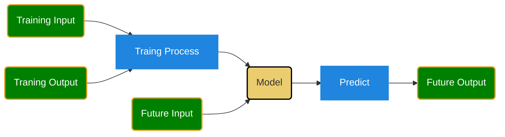
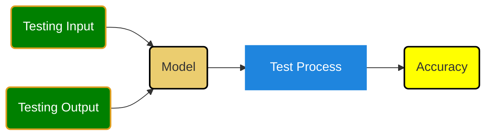
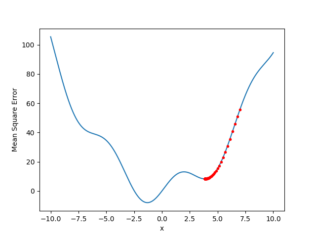

<h1>>machine learning:</h1>

- [Introduction to Machine Learning](#introduction-to-machine-learning)
  - [Basic Knowledge](#basic-knowledge)
- [Data Preprocessing](#data-preprocessing)
- [Supervised Learning Algorithms](#supervised-learning-algorithms)
- [Unsupervised Learning Algorithms](#unsupervised-learning-algorithms)
- [Model Evaluation and Validation](#model-evaluation-and-validation)
- [Overfitting and Underfitting](#overfitting-and-underfitting)
- [Advanced Topics](#advanced-topics)
- [Practical Implementation](#practical-implementation)
- [Projects and Practice](#projects-and-practice)

## Introduction to Machine Learning
- **Books**:
  - [Machine Learning Yearning - by Andrew Ng](machine-learning-yearning.pdf)
  - [Hands-On Machine Learning with Scikit-Learn, Keras, and TensorFlow](Aurelien-Geron-Hands-On-Machine-Learning-with-Scikit-Learn-Keras-and-Tensorflow_-Concepts-Tools-and-Techniques-to-Build-Intelligent-Systems-OReilly-Media-2019.pdf) by Aurélien Géron
- **Online Courses**:
  - [Coursera: Machine Learning by Andrew Ng](https://www.coursera.org/learn/machine-learning)
  - [Udacity: Intro to Machine Learning with PyTorch and TensorFlow](https://www.udacity.com/course/intro-to-machine-learning-with-pytorch--ud188)

❓Wnat is Machine Learning
> Machine Learning is the science (and art) of programming computers so they can learn from data.

> Machine learning (ML) is the process by which computers, including AI, learn new things; people use ML to feed data to the AI and train it over time.

### Basic Knowledge
❓What is Matrix?
[Matrix](matrix.md)

[Solve Linear Equations：鸡兔同笼](linearEquation.md)

❓What is tensor?
> In summary, PyTorch tensors are versatile, support GPU acceleration, and are fundamental for building and training neural networks due to their ability to track gradients.

* [Tensor 点乘](../src/dotProduct.py)

❓What is Accuracy of a model?
[Accuracy](accuracy.md)

[Mean Square Error](mse.md)

❓What is Gradient?
[Gradient detail](gradient.md)
[Understand loss.backward() function](../src/gradient.py)

❓What is Learning Rate?
* [LR controlling the size of the steps taken during gradient descent。](../src/gradientDescend.py)

The learning rate is a crucial hyperparameter in training neural networks, controlling the size of the steps taken during gradient descent. It directly affects how the gradient updates the model's parameters. If the learning rate is too high, the model may overshoot the optimal parameters, leading to divergence or instability in the training process. On the other hand, if the learning rate is too low, the training process will be slow, and the model may get stuck in local minima or saddle points. Therefore, selecting an appropriate learning rate is essential for efficient and effective training of neural networks.
[Math on Partial Derivative respect to $\theta_t$](mse1.md)

* [Understand learning rate](../src/mse1.py)
* [Understand learning rate](../src/mse2.py)

## Data Preprocessing
- **Articles and Tutorials**:
  - [Towards Data Science: Data Preprocessing in Python](https://towardsdatascience.com/data-preprocessing-in-python-pipelines-part-1-fundamentals-5f09529a23a4)
  - [Kaggle: Data Cleaning Challenge](https://www.kaggle.com/learn/cleaning-data)
- **Tools**:
  - **Pandas** for data manipulation: [Pandas Documentation](https://pandas.pydata.org/docs/)
  - **Scikit-learn** for preprocessing techniques: [Scikit-learn Preprocessing](https://scikit-learn.org/stable/modules/preprocessing.html)

## Supervised Learning Algorithms
- **Books**:
  - *"Pattern Recognition and Machine Learning"* by Christopher Bishop
- **Tutorials**:
  - [Scikit-learn: Supervised Learning](https://scikit-learn.org/stable/supervised_learning.html)
  - [Towards Data Science: Supervised Learning Algorithms](https://towardsdatascience.com/understanding-supervised-learning-9a8bbc86d31e)

## Unsupervised Learning Algorithms
- **Books**:
  - *"An Introduction to Statistical Learning"* by Gareth James, Daniela Witten, Trevor Hastie, and Robert Tibshirani (Free PDF available)
- **Tutorials**:
  - [Scikit-learn: Unsupervised Learning](https://scikit-learn.org/stable/unsupervised_learning.html)
  - [Kaggle: Clustering and Dimensionality Reduction](https://www.kaggle.com/learn/unsupervised-learning)

## Model Evaluation and Validation
- **Articles**:
  - [Towards Data Science: Model Evaluation Metrics](https://towardsdatascience.com/metrics-to-evaluate-your-machine-learning-algorithm-f10ba6e38234)
- **Tutorials**:
  - [Scikit-learn: Model Evaluation](https://scikit-learn.org/stable/model_evaluation.html)
  - [Kaggle: Model Validation](https://www.kaggle.com/learn/model-validation)

## Overfitting and Underfitting
- **Articles**:
  - [Towards Data Science: Understanding Overfitting](https://towardsdatascience.com/understanding-overfitting-in-machine-learning-7465e4b4247e)
- **Tutorials**:
  - [Scikit-learn: Regularization](https://scikit-learn.org/stable/modules/linear_model.html#regularization)

## Advanced Topics
- **Deep Learning**:
  - **Books**:
    - *"Deep Learning"* by Ian Goodfellow, Yoshua Bengio, and Aaron Courville (Free online)
  - **Courses**:
    - [Coursera: Deep Learning Specialization by Andrew Ng](https://www.coursera.org/specializations/deep-learning)
    - [Fast.ai: Practical Deep Learning for Coders](https://course.fast.ai/)
- **Transfer Learning**:
  - [Towards Data Science: Transfer Learning](https://towardsdatascience.com/transfer-learning-using-pre-trained-models-f6f04fe4c6e7)
- **Ensemble Methods**:
  - [Scikit-learn: Ensemble Methods](https://scikit-learn.org/stable/modules/ensemble.html)

## Practical Implementation
- **Libraries and Tools**:
  - [Scikit-learn Documentation](https://scikit-learn.org/stable/user_guide.html)
  - [TensorFlow and Keras Documentation](https://www.tensorflow.org/guide/keras)
  - [PyTorch Documentation](https://pytorch.org/tutorials/)
- **Project Ideas**:
  - [Kaggle Competitions](https://www.kaggle.com/competitions)
  - [UCI Machine Learning Repository](http://archive.ics.uci.edu/ml/index.php)

## Projects and Practice
- **Hands-On Projects**:
  - [Coursera: Applied Machine Learning](https://www.coursera.org/specializations/applied-machine-learning)
  - [Kaggle: Micro-Courses](https://www.kaggle.com/learn/overview)
- **Practice Platforms**:
  - [Kaggle](https://www.kaggle.com/)
  - [DataCamp](https://www.datacamp.com/)

