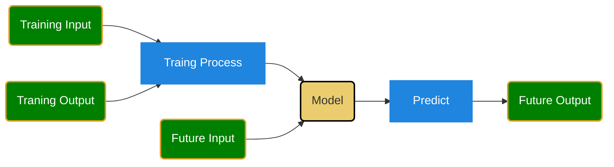
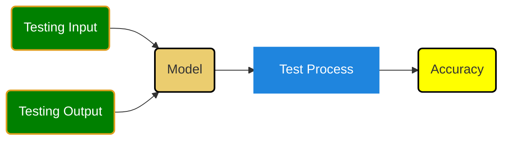

<h1>>machine learning:</h1>

- [Introduction to Machine Learning](#introduction-to-machine-learning)
  - [Basic Knowledge](#basic-knowledge)
- [Data Preprocessing](#data-preprocessing)
  - [鸡兔同笼](#鸡兔同笼)
  - [问题描述](#问题描述)
  - [设定方程](#设定方程)
  - [用矩阵表示方程组](#用矩阵表示方程组)
  - [解矩阵方程](#解矩阵方程)
    - [计算逆矩阵](#计算逆矩阵)
    - [求解 ( X )](#求解--x-)
  - [结果](#结果)
  - [Python 实现](#python-实现)
- [Supervised Learning Algorithms](#supervised-learning-algorithms)
- [Unsupervised Learning Algorithms](#unsupervised-learning-algorithms)
- [Model Evaluation and Validation](#model-evaluation-and-validation)
- [Overfitting and Underfitting](#overfitting-and-underfitting)
- [Advanced Topics](#advanced-topics)
- [Practical Implementation](#practical-implementation)
- [Projects and Practice](#projects-and-practice)


## Introduction to Machine Learning
- **Books**:
  - [Machine Learning Yearning - by Andrew Ng](machine-learning-yearning.pdf)
  - [Hands-On Machine Learning with Scikit-Learn, Keras, and TensorFlow](Aurelien-Geron-Hands-On-Machine-Learning-with-Scikit-Learn-Keras-and-Tensorflow_-Concepts-Tools-and-Techniques-to-Build-Intelligent-Systems-OReilly-Media-2019.pdf) by Aurélien Géron
- **Online Courses**:
  - [Coursera: Machine Learning by Andrew Ng](https://www.coursera.org/learn/machine-learning)
  - [Udacity: Intro to Machine Learning with PyTorch and TensorFlow](https://www.udacity.com/course/intro-to-machine-learning-with-pytorch--ud188)

❓Wnat is Machine Learning
> Machine Learning is the science (and art) of programming computers so they can learn from data.

> Machine learning (ML) is the process by which computers, including AI, learn new things; people use ML to feed data to the AI and train it over time.




### Basic Knowledge
❓What is Matrix?
[Matrix](matrix.md)

[Solve Linear Equations](linearEquation.md)

❓What is tensor?
> In summary, PyTorch tensors are versatile, support GPU acceleration, and are fundamental for building and training neural networks due to their ability to track gradients.

* [鸡兔同笼](../src/chickenRabit.py)

❓What is Accuracy of a model?
[Accuracy](accuracy.md)

[Mean Square Error](mse.md)

## Data Preprocessing
- **Articles and Tutorials**:
  - [Towards Data Science: Data Preprocessing in Python](https://towardsdatascience.com/data-preprocessing-in-python-pipelines-part-1-fundamentals-5f09529a23a4)
  - [Kaggle: Data Cleaning Challenge](https://www.kaggle.com/learn/cleaning-data)
- **Tools**:
  - **Pandas** for data manipulation: [Pandas Documentation](https://pandas.pydata.org/docs/)
  - **Scikit-learn** for preprocessing techniques: [Scikit-learn Preprocessing](https://scikit-learn.org/stable/modules/preprocessing.html)

### 鸡兔同笼
❓What is a matrix?
[Matrix](matrix.md)

[矩阵乘法](https://www.youtube.com/watch?v=1hf_cHNbgCk)

好的，让我们通过鸡兔同笼的问题来学习如何用矩阵解线性方程组。

### 问题描述

假设有一个笼子里有若干只鸡和兔子。已知鸡有2只脚，兔子有4只脚。通过统计，笼子里一共有10个头和28只脚。我们需要确定鸡和兔子的数量。

### 设定方程

我们设鸡的数量为 \( x \)，兔子的数量为 \( y \)。根据题意，我们可以得到以下两个方程：

1. 头的数量： \( x + y = 10 \)
2. 脚的数量： \( 2x + 4y = 28 \)

### 用矩阵表示方程组

我们可以将上述方程组表示为矩阵形式 \( AX = B \)，其中：
\[ A = \begin{pmatrix}
1 & 1 \\
2 & 4
\end{pmatrix}, \quad X = \begin{pmatrix}
x \\
y
\end{pmatrix}, \quad B = \begin{pmatrix}
10 \\
28
\end{pmatrix} \]

### 解矩阵方程

我们需要求解矩阵方程 \( AX = B \)。步骤如下：

1. 求矩阵 \( A \) 的逆矩阵 \( A^{-1} \)。
2. 用逆矩阵乘以 \( B \) 得到 \( X \)，即 \( X = A^{-1}B \)。

#### 计算逆矩阵

对于 \( 2 \times 2 \) 矩阵 \( A \)，其逆矩阵的计算公式为：
\[ A^{-1} = \frac{1}{ad - bc} \begin{pmatrix}
d & -b \\
-c & a
\end{pmatrix} \]
其中 \( A = \begin{pmatrix}
a & b \\
c & d
\end{pmatrix} \)。

对于我们的矩阵 \( A \)：
\[ A = \begin{pmatrix}
1 & 1 \\
2 & 4
\end{pmatrix} \]

我们计算行列式 \( \text{det}(A) \)：
\[ \text{det}(A) = 1 \cdot 4 - 1 \cdot 2 = 4 - 2 = 2 \]

因此，逆矩阵 \( A^{-1} \) 为：
\[ A^{-1} = \frac{1}{2} \begin{pmatrix}
4 & -1 \\
-2 & 1
\end{pmatrix} = \begin{pmatrix}
2 & -0.5 \\
-1 & 0.5
\end{pmatrix} \]

#### 求解 \( X \)

\[ X = A^{-1}B = \begin{pmatrix}
2 & -0.5 \\
-1 & 0.5
\end{pmatrix} \begin{pmatrix}
10 \\
28
\end{pmatrix} \]

我们进行矩阵乘法：
\[ X = \begin{pmatrix}
2 \cdot 10 + (-0.5) \cdot 28 \\
-1 \cdot 10 + 0.5 \cdot 28
\end{pmatrix} = \begin{pmatrix}
20 - 14 \\
-10 + 14
\end{pmatrix} = \begin{pmatrix}
6 \\
4
\end{pmatrix} \]

### 结果

我们得到了 \( X = \begin{pmatrix}
6 \\
4
\end{pmatrix} \)，即鸡的数量为6只，兔子的数量为4只。

### Python 实现

我们也可以用 Python 代码来验证这个结果：

```python
import numpy as np

# 定义矩阵 A 和向量 B
A = np.array([[1, 1],
              [2, 4]])
B = np.array([10, 28])

# 计算逆矩阵 A 的逆
A_inv = np.linalg.inv(A)

# 求解 X
X = np.dot(A_inv, B)

print("鸡的数量:", int(X[0]))
print("兔子的数量:", int(X[1]))
```

运行这个代码，会输出：
```
鸡的数量: 6
兔子的数量: 4
```

通过这个案例，我们用矩阵方法成功地解出了线性方程组，并确定了鸡和兔子的数量。

## Supervised Learning Algorithms
- **Books**:
  - *"Pattern Recognition and Machine Learning"* by Christopher Bishop
- **Tutorials**:
  - [Scikit-learn: Supervised Learning](https://scikit-learn.org/stable/supervised_learning.html)
  - [Towards Data Science: Supervised Learning Algorithms](https://towardsdatascience.com/understanding-supervised-learning-9a8bbc86d31e)

## Unsupervised Learning Algorithms
- **Books**:
  - *"An Introduction to Statistical Learning"* by Gareth James, Daniela Witten, Trevor Hastie, and Robert Tibshirani (Free PDF available)
- **Tutorials**:
  - [Scikit-learn: Unsupervised Learning](https://scikit-learn.org/stable/unsupervised_learning.html)
  - [Kaggle: Clustering and Dimensionality Reduction](https://www.kaggle.com/learn/unsupervised-learning)

## Model Evaluation and Validation
- **Articles**:
  - [Towards Data Science: Model Evaluation Metrics](https://towardsdatascience.com/metrics-to-evaluate-your-machine-learning-algorithm-f10ba6e38234)
- **Tutorials**:
  - [Scikit-learn: Model Evaluation](https://scikit-learn.org/stable/model_evaluation.html)
  - [Kaggle: Model Validation](https://www.kaggle.com/learn/model-validation)

## Overfitting and Underfitting
- **Articles**:
  - [Towards Data Science: Understanding Overfitting](https://towardsdatascience.com/understanding-overfitting-in-machine-learning-7465e4b4247e)
- **Tutorials**:
  - [Scikit-learn: Regularization](https://scikit-learn.org/stable/modules/linear_model.html#regularization)

## Advanced Topics
- **Deep Learning**:
  - **Books**:
    - *"Deep Learning"* by Ian Goodfellow, Yoshua Bengio, and Aaron Courville (Free online)
  - **Courses**:
    - [Coursera: Deep Learning Specialization by Andrew Ng](https://www.coursera.org/specializations/deep-learning)
    - [Fast.ai: Practical Deep Learning for Coders](https://course.fast.ai/)
- **Transfer Learning**:
  - [Towards Data Science: Transfer Learning](https://towardsdatascience.com/transfer-learning-using-pre-trained-models-f6f04fe4c6e7)
- **Ensemble Methods**:
  - [Scikit-learn: Ensemble Methods](https://scikit-learn.org/stable/modules/ensemble.html)

## Practical Implementation
- **Libraries and Tools**:
  - [Scikit-learn Documentation](https://scikit-learn.org/stable/user_guide.html)
  - [TensorFlow and Keras Documentation](https://www.tensorflow.org/guide/keras)
  - [PyTorch Documentation](https://pytorch.org/tutorials/)
- **Project Ideas**:
  - [Kaggle Competitions](https://www.kaggle.com/competitions)
  - [UCI Machine Learning Repository](http://archive.ics.uci.edu/ml/index.php)

## Projects and Practice
- **Hands-On Projects**:
  - [Coursera: Applied Machine Learning](https://www.coursera.org/specializations/applied-machine-learning)
  - [Kaggle: Micro-Courses](https://www.kaggle.com/learn/overview)
- **Practice Platforms**:
  - [Kaggle](https://www.kaggle.com/)
  - [DataCamp](https://www.datacamp.com/)

