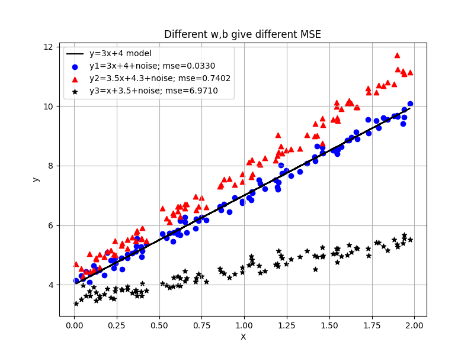

## Mean Squared Error (MSE)

Mean Squared Error (MSE) is a common loss function used in regression tasks to measure the average squared difference between the predicted values and the actual values.

\[ \text{MSE} = \frac{1}{n} \sum_{i=1}^{n} (y_i - \hat{y}_i)^2 \]

where:
- \( n \) is the number of data points,
- \( y_i \) is the actual value of the dependent variable for data point \( i \),
- \( \hat{y}_i \) is the predicted value of the dependent variable for data point \( i \).

MSE is a measure of the quality of an estimator—it is always non-negative, and values closer to zero indicate better fit. However, it has the drawback of not being in the same unit as the original data, making its interpretation somewhat challenging.

Standard deviation is a measure of the amount of variation or dispersion of a set of values. It is calculated as the square root of the variance. The formula for standard deviation is:

\[ \text{SD} = \sqrt{\frac{1}{N} \sum_{i=1}^{N} (x_i - \bar{x})^2} \]

where:
- \( N \) is the number of observations,
- \( x_i \) is the value of the i-th observation,
- \( \bar{x} \) is the mean of the observations.

Standard deviation gives an indication of how spread out the values in a dataset are. A smaller standard deviation indicates that the values are closer to the mean, while a larger standard deviation indicates that the values are more spread out.

## Partial derivative of MSE
👎😱 the MSE above is a scaler number, how to calculate derivative respect to w and b?

Let's derive the partial derivatives of the Mean Squared Error (MSE) with respect to the weights \( w_t \) and bias \( b_t \) for a linear regression model.

Given:
\[ \text{MSE}_t = \left( \frac{1}{n} \sum_{i=1}^{n} (y_i - \hat{y}_i)^2 \right)_t\] 

where:
\[ \hat{y}_i = w_t x_i + b_t \]
and t is iteration at t (epoch)

* [calculate MSE](../src/mse.py)
* [Understand Gradient descending, and learning rate](../src/mse1.py)
* [plot y=3x+4+noise](../src/mse2.py)

黑线是目标model，其他分散数据组是w，b调整中的数据，红，蓝，黑。其中只有蓝色的数据的MSE最小。

## Gradient of MSE

To optimize the MSE loss function using gradient descent, we need to compute its gradient with respect to the predicted values.

The gradient of MSE with respect to the predicted value \( \hat{y}_i \) is given by:

\[ \frac{\partial \text{MSE}}{\partial \hat{y}_i} = \frac{2}{n} (\hat{y}_i - y_i) \]

### Derivation of the Gradient

Let's derive the gradient of MSE respect to w, b step by step:

### Chain Rule
$$\frac {df(g(x))} {dx}=\frac {df} {dg}\frac {dg} {dx}$$

### Matrix Form
Let's represent the variables in matrix form:
- \( \mathbf{X} \) is the matrix of input features, where each row is a feature vector \( x_i \).
- \( \mathbf{w_t} \) is the vector of weights.
- \( \mathbf{b_t} \) is the bias term (a scalar).
- \( \mathbf{y} \) is the vector of true values.
- \( \hat{\mathbf{y}} \) is the vector of predicted values.

In matrix notation, the predictions are:
\[ \hat{\mathbf{y}} = \mathbf{X} \mathbf{w_t} + \mathbf{b_t} \]

The MSE can be written as:
\[ \text{MSE} = \frac{1}{n} (\mathbf{y} - \hat{\mathbf{y}})^2 \]

### Partial Derivatives
1. **Partial Derivative with respect to \( \mathbf{w_t} \)**:
\[ \frac{\partial \text{MSE}}{\partial \mathbf{w_t}} \]

Let's first expand the MSE:
\[ \text{MSE} = \frac{1}{n} (\mathbf{y} - \mathbf{X} \mathbf{w_t} - \mathbf{b_t})^T (\mathbf{y} - \mathbf{X} \mathbf{w_t} - \mathbf{b_t}) \]


Taking the partial derivative with respect to \( \mathbf{w_t} \):
\[ \frac{\partial \text{MSE}}{\partial \mathbf{w_t}} = \frac{1}{n} \frac{\partial}{\partial \mathbf{w_t}} (\mathbf{y} - \mathbf{X} \mathbf{w_t} - \mathbf{b_t})^T (\mathbf{y} - \mathbf{X} \mathbf{w_t} - \mathbf{b_t}) \]

Using the chain rule and matrix differentiation properties:
\[ \frac{\partial \text{MSE}}{\partial \mathbf{w_t}} = \frac{2}{n} \mathbf{X}^T (\mathbf{X} \mathbf{w_t} + \mathbf{b_t} - \mathbf{y}) \]

2. **Partial Derivative with respect to \( \mathbf{b_t} \)**:
\[ \frac{\partial \text{MSE}}{\partial \mathbf{b_t}} \]

Taking the partial derivative with respect to \( \mathbf{b_t} \):
\[ \frac{\partial \text{MSE}}{\partial \mathbf{b_t}} = \frac{1}{n} \frac{\partial}{\partial \mathbf{b_t}} (\mathbf{y} - \mathbf{X} \mathbf{w_t} - \mathbf{b_t})^T (\mathbf{y} - \mathbf{X} \mathbf{w_t} - \mathbf{b_t}) \]

Again, using the chain rule and matrix differentiation properties:
\[ \frac{\partial \text{MSE}}{\partial \mathbf{b_t}} = \frac{2}{n} (\mathbf{X} \mathbf{w_t} + \mathbf{b_t} - \mathbf{y})^T \mathbf{1} \]

Here, \( \mathbf{1} \) is a vector of ones, to account for the sum of the residuals across all data points.

```
np.ones((3, 3))
array([[1., 1., 1.],
       [1., 1., 1.],
       [1., 1., 1.]])
```
### Summary
The partial derivatives of the Mean Squared Error (MSE) with respect to the weights \( \mathbf{w_t} \) and bias \( \mathbf{b_t} \) for different iterations are:

\[ \frac{\partial \text{MSE}}{\partial \mathbf{w_t}} = \frac{2}{n} \mathbf{X}^T (\mathbf{X} \mathbf{w_t} + \mathbf{b_t} - \mathbf{y}) \]

\[ \frac{\partial \text{MSE}}{\partial \mathbf{b_t}} = \frac{2}{n} (\mathbf{X} \mathbf{w_t} + \mathbf{b_t} - \mathbf{y})^T \mathbf{1} \]

* [Use matrix to optimize MSE in Matrix form](../src/mse1.py)
* [adjust w and b at same iterate manually](../src/gradient1.py)
* [NN model, adjust w and b by loss function and optimizer](../src/gradient2.py)

<font style="background-color:yellow">Obviously, NN model gives much better result.</font>

* [Understand dMSE_dw, and dMSE_db](../src/mse2.py)


To print out the MSE for each dataset based on different iterations, we can simulate an optimization process where we iteratively update the weights and bias to minimize the MSE.
[different initial w,b, give samilar result](../src/mse_iterations.py)

```text
Iteration 98: MSE of y1 = 0.8066, MSE of y2 = 0.8066, MSE of y3 = 0.8066
Iteration 99: MSE of y1 = 0.8066, MSE of y2 = 0.8066, MSE of y3 = 0.8066
Iteration 100: MSE of y1 = 0.8066, MSE of y2 = 0.8066, MSE of y3 = 0.8066
[[[2.77098632]],4.214107500930169]
[[[2.76695282]],4.218675727653008]
[[[2.77859456]],4.20549061365153]
```

👍😄 **Conclusion**

- **Initial value of \( w \) and \( b \) is not crucial**: The starting values for weights and biases do not significantly impact the final result, as gradient descent will adjust these values to minimize the MSE.
  
- **Learning rate is sensitive**: The choice of learning rate is critical. If it's too high, the algorithm may overshoot the minimum. If it's too low, the convergence will be slow.
  
- **Iteration count should be limited once MSE minimum is approached**: Increasing the number of iterations beyond the point where the MSE is nearly minimized does not significantly improve the model and can be computationally inefficient.