<h1>Idea of AI Stock Modeling</h1>

## To Do list
### Classified (man labeled buy/sell)
* use savgol_filter() to smooth data before calculate velocity & acceleration(compare with SMA)
* try different NN model (GRU, ...)
* try different activate functions (relu, sigmoid, ...)
* try different loss functions ()
* try different optimizers ()
* testing on real data (实操)

### Future forecast
* backtesting on our own data
* testing on real data (实操)


1. use boolinger line to determine long/short points(max:long, min:short value)
2. smooth (9, 15) all data, use the smoothed data as close[array]
3. calculate vilocity for all points(array)
4. calculate accelerate for all points(array)
5. use a window find stock input smooth data
6. create datasets:
   a. input(close, vilocity, accelerate, weekdays, time, volume)
   b. output(long, short)
7. create model
8. use the model to test training data


<!-- @import "[TOC]" {cmd="toc" depthFrom=1 depthTo=6 orderedList=false} -->

<!-- code_chunk_output -->

- [To Do list](#to-do-list)
  - [Classified (man labeled buy/sell)](#classified-man-labeled-buysell)
  - [Future forecast](#future-forecast)
- [Idea of selecting long,short,hold points](#idea-of-selecting-longshorthold-points)
- [To-do list:](#to-do-list-1)
  - [Data Normalization](#data-normalization)
- [Create datasets](#create-datasets)
- [save and load datasets from file](#save-and-load-datasets-from-file)
- [velocity and acceleration](#velocity-and-acceleration)
- [Training and test data design](#training-and-test-data-design)
- [Add Weights on Data](#add-weights-on-data)
- [Add hold as output as \[long, hold, short\]](#add-hold-as-output-as-long-hold-short)
- [Available Models](#available-models)
  - [卷积神经网络](#卷积神经网络)
  - [Recurrent Neural Network](#recurrent-neural-network)
  - [Attension Machanics](#attension-machanics)
  - [Transform 模型](#transform-模型)
  - [AutoEncoders](#autoencoders)
  - [生成对抗网络](#生成对抗网络)
  - [Reinforcement Learning](#reinforcement-learning)
- [AI无法学习的数据形态](#ai无法学习的数据形态)
- [可变长的时间序列](#可变长的时间序列)
- [GRU model](#gru-model)
- [Load Stock Data to sqlite database](#load-stock-data-to-sqlite-database)
  - [Generate Training \& Testing Data](#generate-training--testing-data)
  - [Create a GRU model](#create-a-gru-model)
  - [Forcast Future Stock Price Range](#forcast-future-stock-price-range)
- [Activate Functions](#activate-functions)

<!-- /code_chunk_output -->


## Idea of selecting long,short,hold points

🛠🎯 Leave this section for 周浩,马头儿

* IPO (input, process, output)
* AI training: from tensor to token
* Prepare tensor (training data and testing data)

* Concern and Issues，solution
  1. simplify and efficiency we choos nasdaq 100 future only.
  2. one minuts data maybe enough
  3. day trading or swing trading
  4. 20 or 30 points as base rule
  5. try Zigzag get training data long/short points
  6. another way to find valley and peak is find edge between MACD cross.


~~最近两个月以来我一直为选择理想的买卖点而苦恼，尝试过多种方法都不理想。到现在我们用的都是“dirty and quick"的方法选择出来的点：在初选出来的最低最高点中选相邻的五点，向前看两步，向后看三步，如果当前点是初选出来的低点里面的相对最低，就选作买点；反之，如果是初选出来的高点里面的相对最高，则选择出来做卖点。
这种选法会出现这样的问题：~~

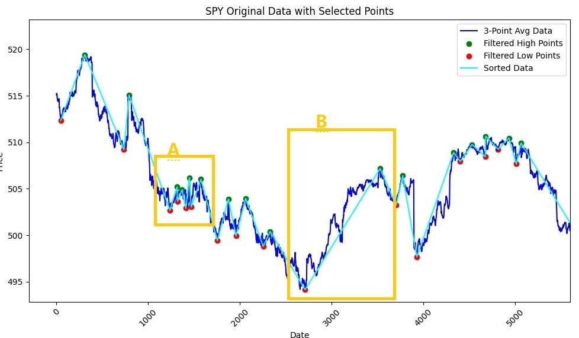

~~看A窗和B窗。因为选择标准是在相邻的初选高低点里面选择，在A区，矮子里面选将军选出的那些点在B区其实是完全不会入选的。在增加了不作为的HOLD点后让事情更加困惑：在B区随便选出来的几个不作为的HOLD点其实都会比A区里面中选的更合适买卖。
我又尝试过用MACD加RSI等等方法来选择买卖的，效果也不理想。单单用MACD选择依然太粗糙，不理想；增加RSI后约束条件又过严，几年时间段里面居然都很难找到几个买卖点。
我因此反思： 无论是现在用的哪种方法，依然都是我常说的AI前的“古典方法”，这些都不是事物的本质，而只是在为了帮助交易而总结出的一些方法，如同几何学里面画的辅助线，不是本质，只是辅助。如果我们回归事物的本质，交易中“低买高卖”，差额越大越好，如此而已。
如果完全等我用”古典方法“来选点做教材来训练AI模型，那完全没有发挥机器学习的效率和优势，应该换思路，给出最基本的“公理”“规则rule”后放手让机器自己去挖掘学习。~~

现在的新算法选择出来的点比前面用的效果好很多，以前的担心不复存在。
现在的选点很简单，用ZigZag 算法（peak_valley_pivots函数）选出所有的“山峰”和“峡谷”，其中对不同的数据选用合适的deviation (minimum relative change necessary to define a peak/valley) 是非常关键的一步。[举一个例子](../src/TestPeakValleys.py), 选用不同的deviation, 数字越大，被选中的点越少；数字越小，被选中的点越多：
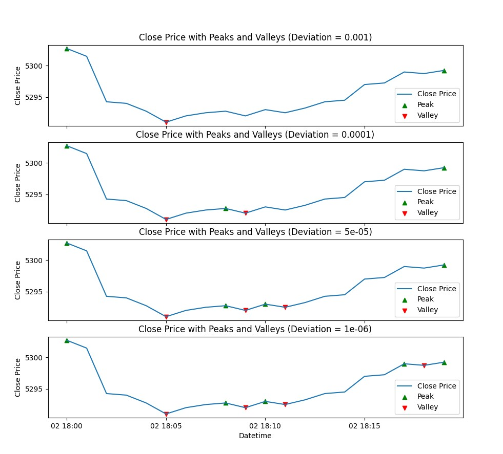

1） 选中了适当的deviation后，可以选择出合适疏密度的peak/valley点，这是第一步


2） 在此基础上，识别出LL(Lower Low), HH(Higher High), LH(Lower High), HL(Higher Low)模式。


具体操作方法是：找到第一个LL点买入，然后只看模式的第二个字符，只要是H就是卖出点；再往后，只要是L就是买入点；如此往复，直到最终。


这里有一个完整的寻找最佳的deviation的例子：采用2023年SPX一分钟数据，数据总量近30万，假定只单纯的买低卖高，每一单的成本2美元。不断的调整deviation的值，最后找到最佳的deviation值在万分之4.7左右，盈利近3万5千点。
[参考源程序](../src/BestTradingFraqStudy.py)
注意： 本程序中只单纯的用了1分钟的数据算出zigzag点，并没有用5分钟的zigzag点来过滤！

```dos

Deviation: 0.01         OHLC len:291380     Zigzag points:158       Total:7030.18
Deviation: 0.001        OHLC len:291380     Zigzag points:6888      Total:29806.09
Deviation: 0.0001       OHLC len:291380     Zigzag points:80882     Total:1173.18
Deviation: 0.00005      OHLC len:291380     Zigzag points:116714    Total:-29882.00

Deviation: 0.0015       OHLC len:291380     Zigzag points:3702      Total:24816.72
Deviation: 0.001        OHLC len:291380     Zigzag points:6888      Total:29806.09
Deviation: 0.0009       OHLC len:291380     Zigzag points:8030      Total:30948.83

Deviation: 0.001        OHLC len:291380     Zigzag points:6888      Total:29806.09
Deviation: 0.0008       OHLC len:291380     Zigzag points:9456      Total:32075.92
Deviation: 0.0006       OHLC len:291380     Zigzag points:14058     Total:34218.01

Deviation: 0.0005       OHLC len:291380     Zigzag points:17778     Total:34809.02
Deviation: 0.0004       OHLC len:291380     Zigzag points:23028     Total:34551.48
Deviation: 0.0003       OHLC len:291380     Zigzag points:31648     Total:32293.35


Deviation: 0.00055      OHLC len:291380     Zigzag points:15774     Total:34583.17
Deviation: 0.0005       OHLC len:291380     Zigzag points:17778     Total:34809.02
Deviation: 0.00045      OHLC len:291380     Zigzag points:20088     Total:34833.88

Deviation: 0.00049      OHLC len:291380     Zigzag points:18288     Total:34836.92
Deviation: 0.00048      OHLC len:291380     Zigzag points:18818     Total:34846.13
Deviation: 0.00047      OHLC len:291380     Zigzag points:19188     Total:34849.77
Deviation: 0.00046      OHLC len:291380     Zigzag points:19566     Total:34846.55

Deviation: 0.00048      OHLC len:291380     Zigzag points:18818     Total:34846.13
Deviation: 0.00045      OHLC len:291380     Zigzag points:20088     Total:34833.88
Deviation: 0.00042      OHLC len:291380     Zigzag points:21932     Total:34688.60

Deviation: 0.0004       OHLC len:291380     Zigzag points:23028     Total:34551.48
Deviation: 0.00035      OHLC len:291380     Zigzag points:26940     Total:33754.56
Deviation: 0.0003       OHLC len:291380     Zigzag points:31648     Total:32293.35

```

对于2022年的SPX一分钟数据，数据总量34万， 同等的情况，最佳deviation是万分之4.9, 盈利9万多点。

```dos

Deviation: 0.0008       OHLC len:341611     Zigzag points:24549     Total:85548.25
Deviation: 0.0007       OHLC len:341611     Zigzag points:28645     Total:87702.47
Deviation: 0.0006       OHLC len:341611     Zigzag points:34023     Total:89393.88

Deviation: 0.00055      OHLC len:341611     Zigzag points:37281     Total:89958.20
Deviation: 0.0005       OHLC len:341611     Zigzag points:41170     Total:90209.82
Deviation: 0.00045      OHLC len:341611     Zigzag points:45526     Total:90064.73

Deviation: 0.00049      OHLC len:341611     Zigzag points:41966     Total:90224.18
Deviation: 0.00048      OHLC len:341611     Zigzag points:42792     Total:90218.15
Deviation: 0.00047      OHLC len:341611     Zigzag points:43650     Total:90189.25
Deviation: 0.00046      OHLC len:341611     Zigzag points:44508     Total:90140.42
```

对于2021年SPX一分钟数据，数据总量33万，最近deviation是万分之4.5

```dos

Deviation: 0.00065      OHLC len:332576     Zigzag:14989    Total:38757.90
Deviation: 0.0006       OHLC len:332576     Zigzag:16589    Total:39274.09
Deviation: 0.00055      OHLC len:332576     Zigzag:18515    Total:39689.07
Deviation: 0.0005       OHLC len:332576     Zigzag:21037    Total:39938.19
Deviation: 0.00045      OHLC len:332576     Zigzag:23859    Total:39944.20
Deviation: 0.0004       OHLC len:332576     Zigzag:27103    Total:39642.27
Deviation: 0.0003       OHLC len:332576     Zigzag:37175    Total:36961.69
```

在交易成本稳定的情况下，3年的deviation也相当的稳定，在万分之5到4.5之间。

在交易成本固定的情况下，计算机如果真的能每笔交易都成功，它自然会采取相当频繁交易的办法，聚沙成塔。我们可以看一看按万分之5左右的值产生的Zigzag点，非常非常密集，远比前面例子里面我选择的要密集。这是非常自然的选择。

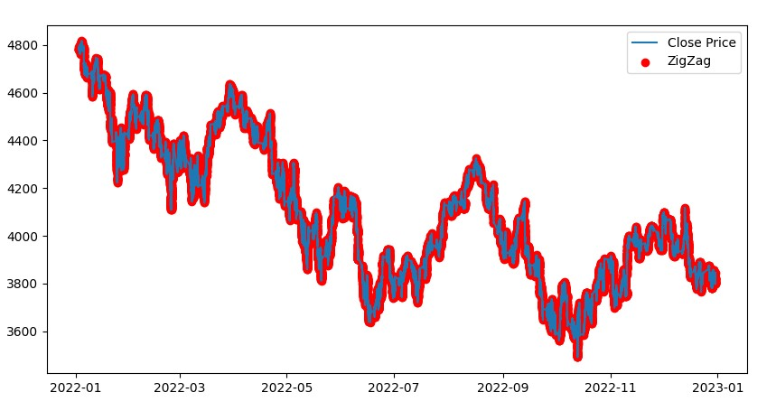

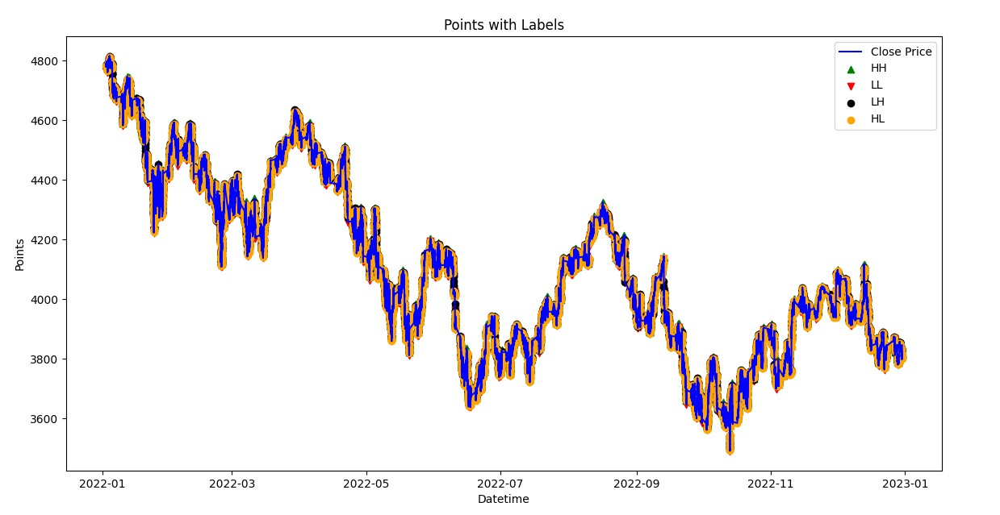

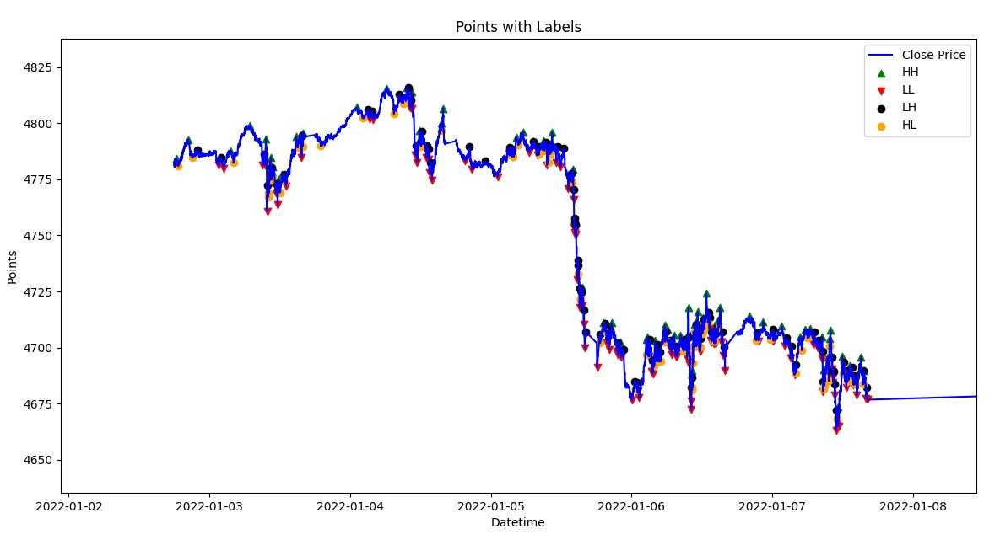

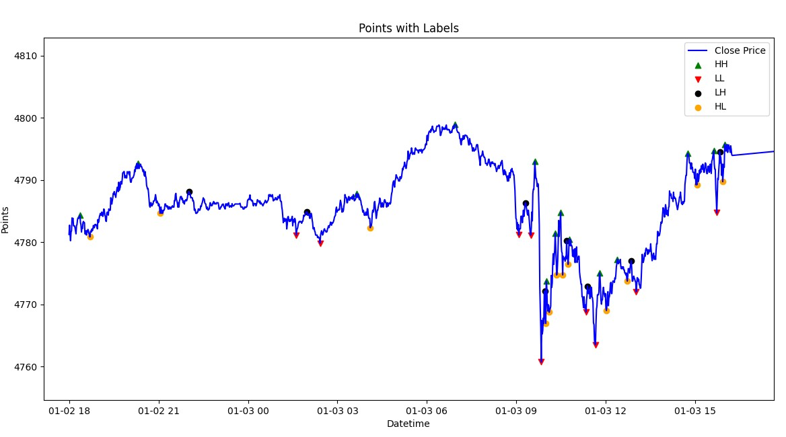


* [Generating training and testing dataset to csv file](../src/GenTrainTestData.py)

```dos
Useful parameters 

1. IsDebug:　打开／关闭调试信息。在调试阶段特别有用;
2. SN: Serial number for different dataset：　生成的训练／测试数据集的序列号;
3. tdLen:　训练／测试数据的长度;
4. symbol: 处理的股票的符号;
5. table_name: 从数据库中查询数据的表名。
6. data_dir: 数据文件目录名
7. training_start_date: 训练数据开始日期
8. training_end_date： 训练数据终止日期
9. testing_start_date：测试数据开始日期
10. testing_end_date： 测试数据终止日期

上述的参数设定后，将按照如下格式生成的训练数据：
td_file = os.path.join(data_dir, f"{symbol}_TrainingData_{tdLen}_{SN}.csv")

实例：SPY窗口宽度为50的第30号训练数据集
SPY_TestingData_50_30.csv
想对应的就有测试数据集
SPY_TestingData_50_30.csv
```

## To-do list:
1. 增加训练数据的column: （ MACD = EMA（12）- EMA(26)；
2. 对MACD数据做EMA(9)的曲线；
3. 增加训练数据column： MACD- EMA(9)
4. 过滤： box / 箱体 （幅度不到20的点过滤掉）
5. 使用卷积模型完成训练

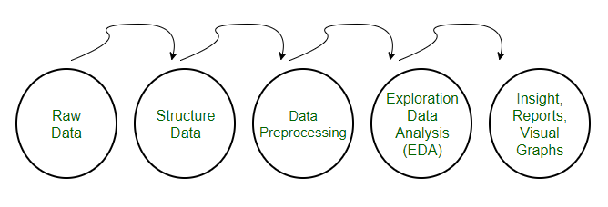
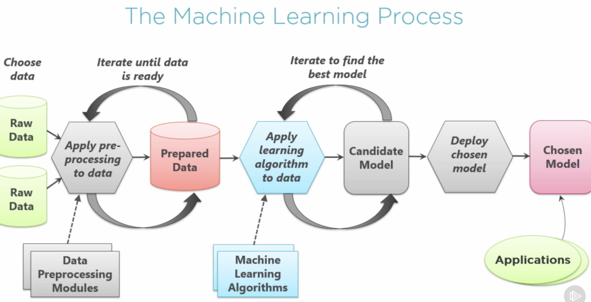
>
### Data Normalization

It is generally a good practice to normalize the input features, including price, when training a machine learning model for stock prediction. Normalization helps to scale the features to a similar range, which can improve the convergence of the model during training and prevent certain features from dominating others. Normalizing the input features can also make the model more robust to changes in the scale of the data.

However, the specific choice of normalization method can depend on the characteristics of your data and the model you are using. Common normalization techniques include min-max scaling (scaling to a range of [0, 1]) or standardization (scaling to have mean 0 and standard deviation 1). Experimenting with different normalization methods and observing the impact on the model's performance can help you determine the best approach for your stock prediction task.

## Create datasets

* [create datasets from stock raw data](../src/datasets.py)
* [Generating training and test data save to ...](../src/GenTrainTestData.py)
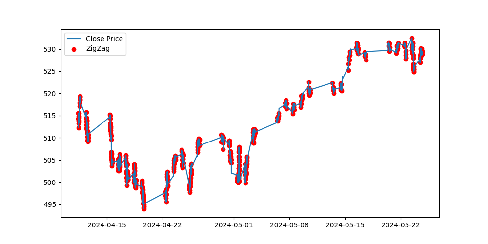
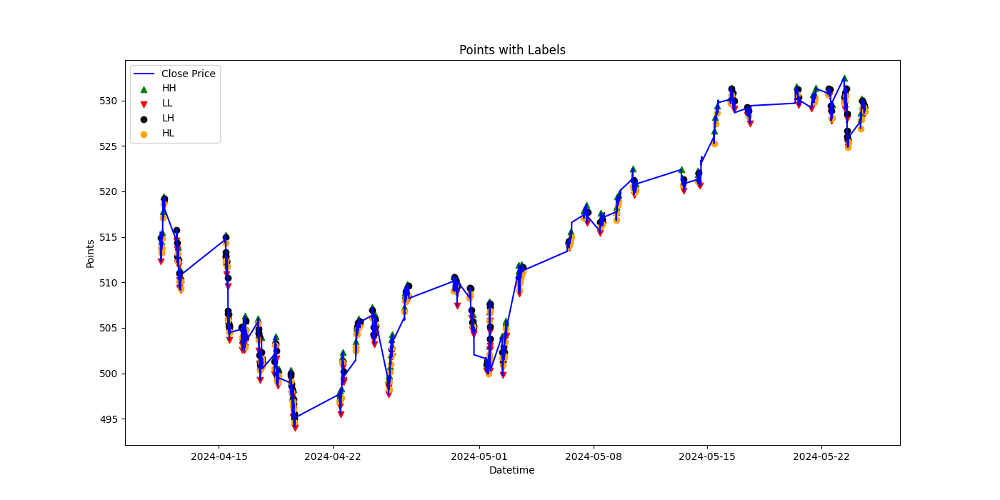
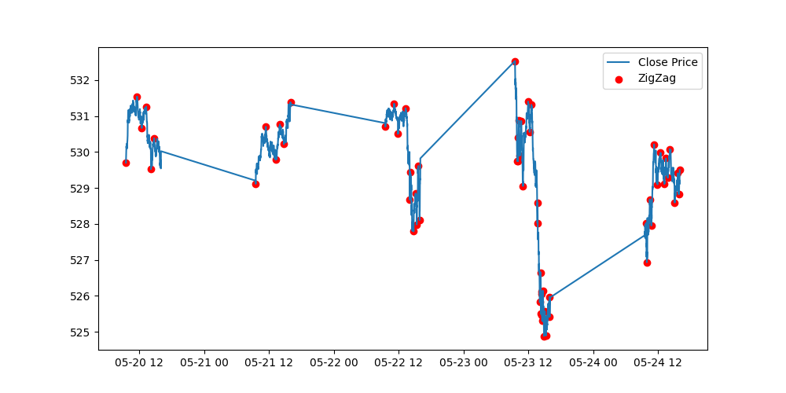
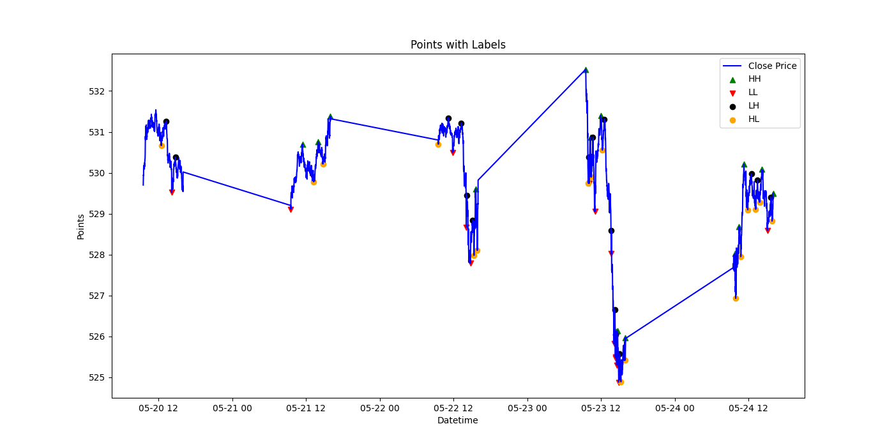

[](../src/GenTrainTestDataBig.py)
1. data/stock_bigdata_2019-2023.db
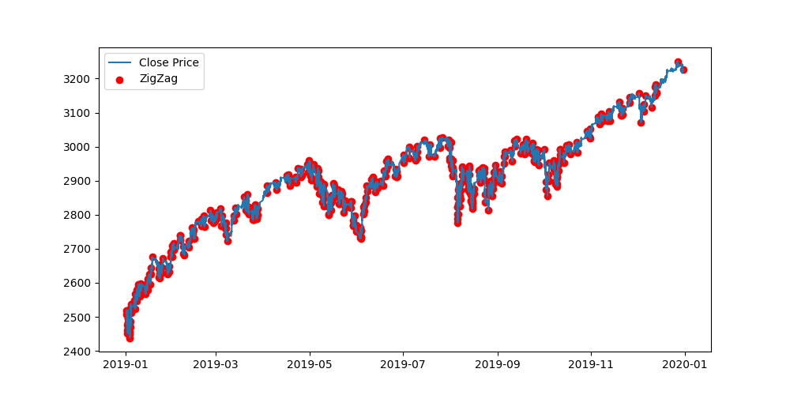
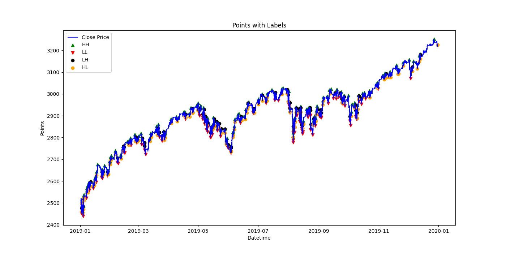
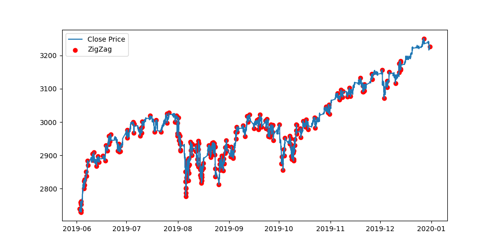
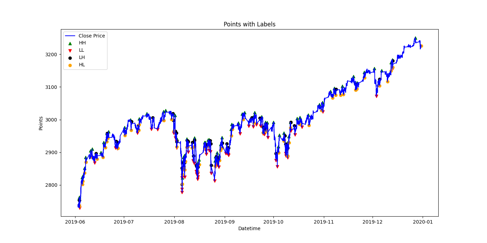


## save and load datasets from file

* better file format

```csv
long,short,[(weekdays,time,close,slope,accelerate,volume),(...)]
0.1,0.2,0.3,0.4,0.5,0.6,0.7
0.2,0.3,0.4,0.5,0.6,0.8,0.9
0.3,0.4,0.5,0.6,0.7,0.5,0.4
...
```

## velocity and acceleration

$$v_i=\frac {c_{i+1}-c_{i-1}} {t_{i+1}-t_{i-1}}$$
i.e. the velocity at $t_i$ equals the difference of the "close" at $t_{i+1}$ and $t_{i-1}$. same as accelerate as below:
$$a_i=\frac {v_{i+1}-v_{i-1}} {t_{i+1}-t_{i-1}}$$

## Training and test data design

* csv file format
```
long,short,weekdays,time,price,volume,velocity,acceleration,...
1,0,2.0,10.0,503.039,2.3,0.12,1232,2.0,10.123,503.3,2.1,0.3,1354,...
1,0,2.0,10.0,503.039,2.3,0.12,1232,2.0,10.123,503.3,2.1,0.3,1354,...
... ...
```
[sample data file](../data/SPY_TraningData06.csv)
Sample format:
```csv
long,short,weekday,time,price,volume,velocity,acceleration,... ...
1,0,4.0000,10.1167,513.3700,230304.0000,-0.0600,0.1100,4.0000,10.1333,513.2700,389610.0000,-0.1000,-0.0400,4.0000,10.1500,513.2300,116196.0000,-0.0400,0.0600,4.0000,10.1667,513.0700,125490.0000,-0.1600,-0.1200,4.0000,10.1833,512.9400,308380.0000,-0.1300,0.0300,4.0000,10.2000,512.8300,153775.0000,-0.1100,0.0200,4.0000,10.2167,512.9300,191395.0000,0.1000,0.2100,4.0000,10.2333,512.7600,186673.0000,-0.1700,-0.2700,4.0000,10.2500,512.5800,243147.0000,-0.1800,-0.0100,4.0000,10.2667,512.3400,222841.0000,-0.2400,-0.0600
1,0,5.0000,15.1167,509.5700,91117.0000,-0.0400,-0.0500,5.0000,15.1333,509.5500,153922.0000,-0.0200,0.0200,5.0000,15.1500,509.4800,136941.0000,-0.0700,-0.0500,5.0000,15.1667,509.5900,115541.0000,0.1100,0.1800,5.0000,15.1833,509.5900,146988.0000,0.0000,-0.1100,5.0000,15.2000,509.5700,122923.0000,-0.0200,-0.0200,5.0000,15.2167,509.4300,163968.0000,-0.1400,-0.1200,5.0000,15.2333,509.3400,110492.0000,-0.0900,0.0500,5.0000,15.2500,509.2600,243777.0000,-0.0800,0.0100,5.0000,15.2667,509.2000,151465.0000,-0.0600,0.0200
...
0,1,4.0000,11.2333,503.6100,50585.0000,0.0400,0.0500,4.0000,11.2500,503.7300,168161.0000,0.1200,0.0800,4.0000,11.2667,503.8700,92983.0000,0.1400,0.0200,4.0000,11.2833,503.9000,221729.0000,0.0300,-0.1100,4.0000,11.3000,503.8400,129542.0000,-0.0600,-0.0900,4.0000,11.3167,503.7500,130294.0000,-0.0900,-0.0300,4.0000,11.3333,503.8200,84013.0000,0.0700,0.1600,4.0000,11.3500,503.9100,49237.0000,0.0900,0.0200,4.0000,11.3667,503.9600,259312.0000,0.0500,-0.0400,4.0000,11.3833,503.9700,92385.0000,0.0100,-0.0400
0,1,4.0000,15.4333,499.7100,180733.0000,0.0600,0.0000,4.0000,15.4500,499.7700,130763.0000,0.0600,0.0000,4.0000,15.4667,499.8200,110770.0000,0.0500,-0.0100,4.0000,15.4833,499.7900,105657.0000,-0.0300,-0.0800,4.0000,15.5000,499.8400,224877.0000,0.0500,0.0800,4.0000,15.5167,499.9200,147421.0000,0.0800,0.0300,4.0000,15.5333,499.9700,269021.0000,0.0500,-0.0300,4.0000,15.5500,500.0700,131807.0000,0.1000,0.0500,4.0000,15.5667,500.1400,149343.0000,0.0700,-0.0300,4.0000,15.5833,500.2500,164901.0000,0.1100,0.0400

```
* training dataset format
trainingDataset.shape = [18,6,10]

```py
outputs_tensor = torch.tensor(outputs).reshape(18,2)
inputs_tensor = torch.tensor(inputs).reshape(18,1,6,10)
```
where
1. 18 is total number of training data.
2. 2 in outputs_tensor is 1 demension 2 items array, ['long', 'short'].
3. 6 in inputs_tensor is 6 columns as (weekdays,time,close,velocity,acceleration,volume).
4. 10 in inputs_tensor is window size, which means we start from current time backwards for 10 data.

Sample input tensor
```
tensor([[[ 4.0000e+00,  1.0117e+01,  5.1337e+02,  ...,  1.0133e+01,
           5.1327e+02,  3.8961e+05],
         [-1.0000e-01, -4.0000e-02,  4.0000e+00,  ...,  6.0000e-02,
           4.0000e+00,  1.0167e+01],
         [ 5.1307e+02,  1.2549e+05, -1.6000e-01,  ...,  3.0838e+05,
          -1.3000e-01,  3.0000e-02],
         [ 4.0000e+00,  1.0200e+01,  5.1283e+02,  ...,  1.0217e+01,
           5.1293e+02,  1.9140e+05],
         [ 1.0000e-01,  2.1000e-01,  4.0000e+00,  ..., -2.7000e-01,
           4.0000e+00,  1.0250e+01],
         [ 5.1258e+02,  2.4315e+05, -1.8000e-01,  ...,  2.2284e+05,
          -2.4000e-01, -6.0000e-02]],

        [[ 5.0000e+00,  1.5117e+01,  5.0957e+02,  ...,  1.5133e+01,
           5.0955e+02,  1.5392e+05],
         [-2.0000e-02,  2.0000e-02,  5.0000e+00,  ..., -5.0000e-02,
           5.0000e+00,  1.5167e+01],
         [ 5.0959e+02,  1.1554e+05,  1.1000e-01,  ...,  1.4699e+05,
           0.0000e+00, -1.1000e-01],
         [ 5.0000e+00,  1.5200e+01,  5.0957e+02,  ...,  1.5217e+01,
           5.0943e+02,  1.6397e+05],
         [-1.4000e-01, -1.2000e-01,  5.0000e+00,  ...,  5.0000e-02,
           5.0000e+00,  1.5250e+01],
         [ 5.0926e+02,  2.4378e+05, -8.0000e-02,  ...,  1.5146e+05,
          -6.0000e-02,  2.0000e-02]],

        [[ 2.0000e+00,  1.0483e+01,  5.0329e+02,  ...,  1.0500e+01,
           5.0327e+02,  2.2177e+05],
         [-2.0000e-02,  9.0000e-02,  2.0000e+00,  ...,  2.0000e-02,
           2.0000e+00,  1.0533e+01],
         [ 5.0323e+02,  1.0411e+05, -4.0000e-02,  ...,  2.6403e+05,
          -8.0000e-02, -4.0000e-02],
         [ 2.0000e+00,  1.0567e+01,  5.0315e+02,  ...,  1.0583e+01,
           5.0307e+02,  9.7668e+04],
         [-8.0000e-02, -8.0000e-02,  2.0000e+00,  ..., -1.0000e-01,
           2.0000e+00,  1.0617e+01],
         [ 5.0271e+02,  2.7079e+05, -1.8000e-01,  ...,  1.4372e+05,
          -3.0000e-02,  1.5000e-01]],

        ...,

        [[ 3.0000e+00,  1.4600e+01,  5.0168e+02,  ...,  1.4617e+01,
           5.0171e+02,  7.9677e+04],
         [ 3.0000e-02,  1.3000e-01,  3.0000e+00,  ...,  9.0000e-02,
           3.0000e+00,  1.4650e+01],
         [ 5.0207e+02,  9.1089e+04,  2.4000e-01,  ...,  9.8564e+04,
           3.2000e-01,  8.0000e-02],
         [ 3.0000e+00,  1.4683e+01,  5.0288e+02,  ...,  1.4700e+01,
           5.0323e+02,  4.1820e+05],
         [ 3.5000e-01, -1.4000e-01,  3.0000e+00,  ..., -1.0000e-02,
           3.0000e+00,  1.4733e+01],
         [ 5.0372e+02,  2.0590e+05,  1.5000e-01,  ...,  2.3435e+05,
           1.8000e-01,  3.0000e-02]],

        [[ 4.0000e+00,  1.1233e+01,  5.0361e+02,  ...,  1.1250e+01,
           5.0373e+02,  1.6816e+05],
         [ 1.2000e-01,  8.0000e-02,  4.0000e+00,  ...,  2.0000e-02,
           4.0000e+00,  1.1283e+01],
         [ 5.0390e+02,  2.2173e+05,  3.0000e-02,  ...,  1.2954e+05,
          -6.0000e-02, -9.0000e-02],
         [ 4.0000e+00,  1.1317e+01,  5.0375e+02,  ...,  1.1333e+01,
           5.0382e+02,  8.4013e+04],
         [ 7.0000e-02,  1.6000e-01,  4.0000e+00,  ...,  2.0000e-02,
           4.0000e+00,  1.1367e+01],
         [ 5.0396e+02,  2.5931e+05,  5.0000e-02,  ...,  9.2385e+04,
           1.0000e-02, -4.0000e-02]],

        [[ 4.0000e+00,  1.5433e+01,  4.9971e+02,  ...,  1.5450e+01,
           4.9977e+02,  1.3076e+05],
         [ 6.0000e-02,  0.0000e+00,  4.0000e+00,  ..., -1.0000e-02,
           4.0000e+00,  1.5483e+01],
         [ 4.9979e+02,  1.0566e+05, -3.0000e-02,  ...,  2.2488e+05,
           5.0000e-02,  8.0000e-02],
         [ 4.0000e+00,  1.5517e+01,  4.9992e+02,  ...,  1.5533e+01,
           4.9997e+02,  2.6902e+05],
         [ 5.0000e-02, -3.0000e-02,  4.0000e+00,  ...,  5.0000e-02,
           4.0000e+00,  1.5567e+01],
         [ 5.0014e+02,  1.4934e+05,  7.0000e-02,  ...,  1.6490e+05,
           1.1000e-01,  4.0000e-02]]])
```

sample training output tensor

```
tensor([[1., 0.],
        [1., 0.],
        [1., 0.],
        [1., 0.],
        [1., 0.],
        [1., 0.],
        [1., 0.],
        [1., 0.],
        [1., 0.],
        [0., 1.],
        [0., 1.],
        [0., 1.],
        [0., 1.],
        [0., 1.],
        [0., 1.],
        [0., 1.],
        [0., 1.],
        [0., 1.]])
```
index=0, 表明该窗口数据属于long类。index=1，表面该窗口数据属于short类。

预测结果实例：
predict=[-0.27,3.45]
由于index=1的数字更大，表明该输入数据被认定为short。

* test dataset format
test datasets 和training datasets两者的输入结构是相同的，但是输出的结构是不同的。对于训练用的数据，输出部分也是一个二维矩阵（见上面的实际例子），表示该给定窗口数据的分类，或者是long，或者是short，用[1,0]表示设定为long，用[0,1]设定为short。
而test数据的输出，只是一个一维矩阵，包含每个窗口的正确结果所处的位置（index）。对于上面给出的18行的数据，测试Tensor看起来应该是这样的：
[0,0,0,0,0,0,0,0,0,1,1,1,1,1,1,1,1,1]
他表示前8行属于0类，也就是long类；后8行属于1类，也就是short类。
在我们的程序中是通过下面的程序段达到这样的效果。


```py
test_output_tensor = torch.tensor([int(y == 1.0) for x, y in outputs])
```
这里巧妙地应用了将bool数据转换成整数的方法，也就是int(True)为1，int(Fale)为0.还要注意到我们的long和short是相关的，x=1则y=0,反之亦然。所以程序中只使用了y的值，就得到了正确的测试输出数组。

👍😄 **Conclusion**
运行
* [read stock data, build model, save model to a file，stock.py](../src/stock.py)


```py input data
file_path = 'stockdata/SPY_TraningData_30_07.csv'
```

❌😢<font style="background-color:yellow">仅仅得到50%的精准度，表明这样的数据结构和NN模型是完全不能够预测股票走势的。</font>

[use model file to predict stock data(which is same as the trainging data)](../src/stock1.py)


```
tensor([[1., 0.,0],
        [1., 0.,0],
        [1., 0.,0],
        [0., 0.,1],
        [0.,1,0.],
        ...
        [0., 1.]])
```
* [load model from file built by stock.py, use the model to test](../src/stock1.py)

```py input data
file_path = 'stockdata/SPY_TraningData_30_07.csv'
```


```text
(env) C:\Users\wangq\workspace\LearnTorch>c:/Users/wangq/workspace/LearnTorch/env/Scripts/python.exe c:/Users/wangq/workspace/LearnTorch/src/stock1.py
18
18 180
window: 30
Predicted: "long", Actual: "long"
Predicted: "long", Actual: "long"
Predicted: "long", Actual: "long"
Predicted: "long", Actual: "long"
Predicted: "long", Actual: "long"
Predicted: "long", Actual: "long"
Predicted: "short", Actual: "long"
Predicted: "long", Actual: "long"
Predicted: "short", Actual: "long"
Predicted: "short", Actual: "short"
Predicted: "short", Actual: "short"
Predicted: "short", Actual: "short"
Predicted: "short", Actual: "short"
Predicted: "short", Actual: "short"
Predicted: "short", Actual: "short"
Predicted: "short", Actual: "short"
Predicted: "short", Actual: "short"
Predicted: "long", Actual: "short"
accuracy: 83.33
```

👍😄 令人可喜的结论：
> 一旦模型保存在文件中，重复使用的精度是一直保持着的。

👎😢 可悲的是：
> 训练数据和测试数据完全相同的情况下，精度应该是100%才对。“预测偏离”
> 1. window=30 太小
> 2. 只有18个点，训练数据太少。
> 3. 线性模型不够好？

🔔⚡️ <font style="background-color:yellow">偶然发现的buy的测试比sell的测试更精确的现象是不存在的。根据目前的结果，两者没有差异。</font>

* [plot one window data with Velocity or Accelaration, stock2.py](../src/stock2.py)

* [read training and testing data separately, stock4.py](../src/stock4.py)

## Add Weights on Data

* [add linear weights on Data, stock5.py](../src/stock5.py)

如果训练数据不包括测试数据（stockdata/SPY_TrainingData_200_09.csv, 53points），精度较低，最高只达到84%。

如果训练数据包括测试数据（stockdata/SPY_TrainingData_200_10.csv, 65points），精度较高，最高可达到100%。65points中有13个用来作为测试数据。

```text 线性加权
Epoch 19********************
loss: 3.667773  [    5/   65]
loss: 0.000000  [   30/   65]
loss: 0.000000  [   55/   65]
Test Error:
 Accuracy: 100.0%, Avg loss: 0.000000

Epoch 20********************
loss: 3.534004  [    5/   65]
loss: 0.000000  [   30/   65]
loss: 0.000000  [   55/   65]
Test Error:
 Accuracy: 100.0%, Avg loss: 0.000000

Done with training.
Saved PyTorch Model State to stock_model_200_10_100_linearWeighted.pth
```

* [add exponential weights on Data and normalization](../src/stock6.py)
1. 原始价格，最好精度=92%
2. 只归一，最好精度=66%
3. 归一加指数权重，最好精度=60%

👍😄 **Conclusion**

> 感觉使用原始数据所做的模型精度，远好于归一化后的数据。“预测偏离”
> 加权后并没有改进精度。
> 因为我们并没有与其他数据作比对，所以归一化应该没有任何影响才对。😢😢

* [comparison of linear and exponential weights](../src/stock7.py)


## Add hold as output as [long, hold, short]


💡👉 Idea of selecting hold points
1. between long and short, evenly select 3 or 5 points as hold points.

* [add hold to classify long and short](../src/stock8.py)
* [training data with row=196, window=50, column=6](../stockdata/SPY_TrainingData_50_13.csv)
* [testing data with row=196, window=50, column=6](../stockdata/SPY_TestingData_50_13.csv)

```
Epoch 20********************
loss: 1.341251  [    4/  196]
loss: 1.352880  [   20/  196]
loss: 1.736566  [   36/  196]
loss: 1.582978  [   52/  196]
loss: 0.872862  [   68/  196]
loss: 0.565427  [   84/  196]
loss: 0.624644  [  100/  196]
loss: 0.593255  [  116/  196]
loss: 0.521536  [  132/  196]
loss: 0.528101  [  148/  196]
loss: 0.471056  [  164/  196]
loss: 0.508025  [  180/  196]
loss: 0.434915  [  196/  196]
Test Error:
 Accuracy: 67.4%, Avg loss: 0.844671

Done with training.
Saved PyTorch Model State to best_stock_model_69.pth
```
修改了程序，把最高精度的模型保存在文件中。

第13套数据只获得最高69%的精度。

## Available Models


### 卷积神经网络
[](ConvolutionalNeuralNetworks.md)
[李永乐老师讲卷积](https://www.youtube.com/watch?v=AFlIM0jSI9I)
* [卷积神经网络does NOT work](../src/cnn.py)
* [卷积神经网络works from ChatGPT directly](../src/cnn1.py)
* [卷积神经网络with data SPY_TrainingData_200_10.csv works](../src/stock_cnn_wang.py)

get 93% accuracy easily.

### Recurrent Neural Network

* [Recurrent Neural Network from ChatGPT](../src/rnn.py)
* [Recurrent with data SPY_TrainingData_200_10.csv works](../src/stock_rnn_wang.py)
the accura 67.7%.

### Attension Machanics

* [Attension Machanics model from ChatGPT](../src/attention.py)
* [Use attensio Machinics model train stock data](../src/stock_attension_wang.py)
Accuracy: 60.0%, Avg loss: 0.690121

### Transform 模型

* [Trasform model class from ChatGPT](../src/transform.py)
* [Use Transform model train stock data](../src/stock_transform_wang.py)
 Accuracy: 100.0%, Avg loss: 0.002986

### AutoEncoders

* [](../src/autoencoder.py)
* [Auto Encode model from ChatGPT](../src/autoencoder2.py)
* [Use Auto Encode model train stock data](../src/stock_autoencode_wang.py)
Accuracy: 100.0%, Avg loss: 0.000001

### 生成对抗网络
Generative Adversarial Network (GAN)

* [understand what it is](../src/gan.py)
* [Successful](../src/gan1.py)

### Reinforcement Learning

* [Need use real data](../src/reinforcement.py)

## AI无法学习的数据形态

😢📌一旦数据量增大，几乎所有的模型都只能得到50%的精度，甚至更低。

* [卷积模型，2328买卖点，窗口30，只得到50%](../src/stock_cnn_wang_150.py)
* [卷积模型，2328买卖点，只得到50%](../src/stock_cnn_wang_151.py)
* [卷积模型，2328买卖点，只得到50%](../src/stock_cnn_wang_152.py)
* [Transform，2328买卖点，窗口60，只得到50%](../src/stock_transform_wang_151.py)
* [只取一列价格数据，固定窗口为30个点，只得到50%](../src/stock_160.py)

```dos
Epoch 20********************
loss: 0.868377  [   64/ 9066]
loss: 0.867910  [ 4160/ 9066]
loss: 0.542266  [ 8256/ 9066]
Test Error: 
 Accuracy: 50.0%, Avg loss: 0.704931
```
## 可变长的时间序列

> 按照数据变化样式取训练数据，按照最长的时间序列，将短的时间序列用0补足。

❓😢这样做，可能对训练和测试解决“没有可学习的数据形态”的问题，但是如何在预测中构造你的输入数据呢？难在预测时，如何确定输入数据的长度呢？

💡👉Deep Learning crucial points

1. The training data must be learnable.
2. The test data should contain patterns similar to those in the training data.
3. The input data for predictions should have patterns similar to the trained input data.

* [Time Series Transformer model](../src/Test_TimeSeriesTransformer_03.py)
[Time Series Data](../data/SPX_TrainingData_200.csv)
[quick plot tool](../src/plotTools.py)


show the buy/sell pair dataset. it definitely has from low to hight pattern, but cannot be used in prediction.

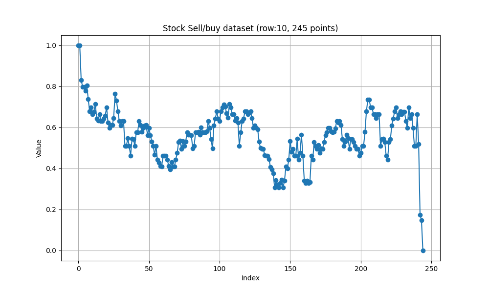
since the time series difference, the row 5710 has only 13 points data, and row 10 has 245 points, huge difference. question is how to pad the data to keep the same learnable pattern?

👎😱 all different length dataset, has similer pattern, which is from low to high, or vice versa. computer will learn nothing but this simple pattern!

```debug
padded_sequences[2,:]
tensor([1.0000, 0.7732, 0.9991, 0.8992, 0.7307, 0.7309, 0.5683, 0.7300, 0.2079,
        0.0000, 0.0000, 0.0000, 0.0000, 0.0000, 0.0000, 0.0000, 0.0000, 0.0000,
        0.0000, 0.0000, 0.0000, 0.0000, 0.0000, 0.0000, 0.0000, 0.0000, 0.0000,
```

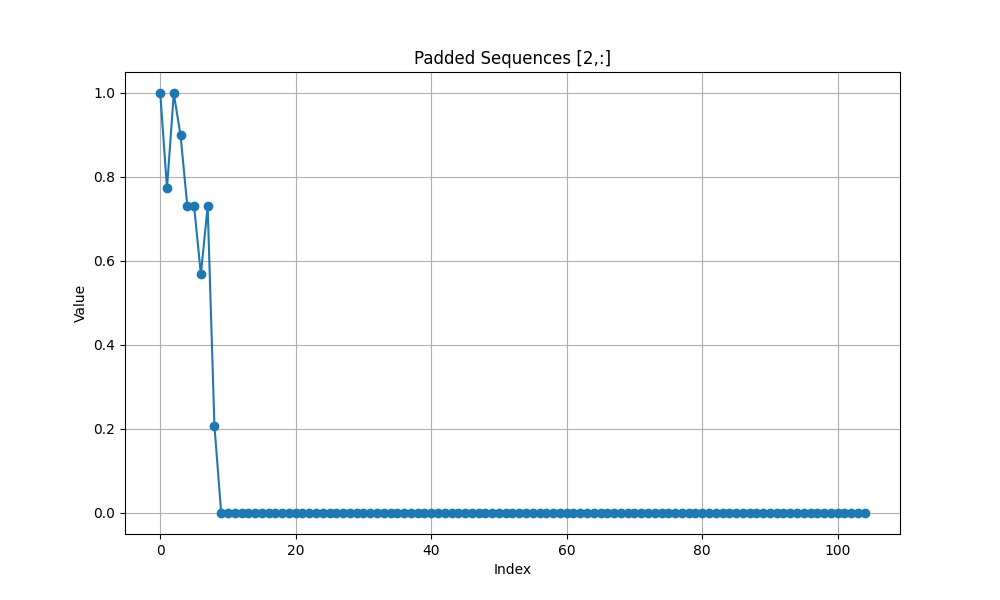

```
mask[1,:]
tensor([False, False, False, False, False, False, False, False, False, False,
        False, False, False, False, False, False, False, False, False, False,
        False, False, False, False, False, False, False, False, False, False,
        False, False, False, False, False, False, False, False, False, False,
        False, False, False, False, False, False, False, False, False, False,
        False, False, False, False, False, False, False, False, False, False

len(mask[1,:])
357        
```

```py
for epoch in range(num_epochs):
    epoch_start_time = time.time()
    epoch_loss = 0.0
    print(f"Starting epoch {epoch+1}/{num_epochs}...")
    for (low_batch, low_mask), (high_batch, high_mask) in zip(low_dataloader, high_dataloader):
        for batch, mask in [(low_batch, low_mask), (high_batch, high_mask)]:
            batch = batch.unsqueeze(-1)  # Adding feature dimension
            tgt_input = batch[:, :-1, :]
            tgt_output = batch[:, 1:, :]

            tgt_subsequent_mask = create_subsequent_mask(tgt_input.size(1)).to(tgt_input.device)

            optimizer.zero_grad()
💡👉       output = model(
                batch, tgt_input, tgt_mask=tgt_subsequent_mask, 
                src_key_padding_mask=mask, tgt_key_padding_mask=mask[:, :-1]
            )
            print(f"Model output shape: {output.shape}")
```

tgt_output.shape
torch.Size([32, 82, 1])

tgt_intput: target input
tgt_input.shape
torch.Size([32, 82, 1])
共有32套数据，每套有82个价格，单一价格描述股票属性。关键是大部分的数据是后缀补0.

batch.shape
torch.Size([32, 83, 1])

tgt_subsequent_mask.shape
torch.Size([82, 82])

tgt_subsequent_mask
tensor([[False,  True,  True,  ...,  True,  True,  True],
        [False, False,  True,  ...,  True,  True,  True],
        [False, False, False,  ...,  True,  True,  True],
        ...,
        [False, False, False,  ..., False,  True,  True],
        [False, False, False,  ..., False, False,  True],
        [False, False, False,  ..., False, False, False]])

mask.shape
torch.Size([32, 83])

mask
tensor([[False, False, False,  ...,  True,  True,  True],
        [False, False, False,  ...,  True,  True,  True],
        [False, False, False,  ...,  True,  True,  True],
        ...,
        [False, False, False,  ...,  True,  True,  True],
        [False, False, False,  ...,  True,  True,  True],
        [False, False, False,  ...,  True,  True,  True]])

output.shape
torch.Size([32, 82, 1])

output.shape
torch.Size([2624, 1])

tgt_output.shape
torch.Size([2624, 1])

output
tensor([[ 0.3952],
        [ 0.1312],
        [ 0.5834],
        ...,
        [ 0.3008],
        [ 0.4594],
        [-0.0273]], grad_fn=<ViewBackward0>)

tgt_output
tensor([[0.6721],
        [0.5523],
        [0.6548],
        ...,
        [0.0000],
        [0.0000],
        [0.0000]])


## GRU model

## Load Stock Data to sqlite database
* [Download stock data from internet and save it into CSV file]()
* [read CSV file and save to Sqlite database](../src/WriteCsvToSql.py)
* [](../src/ConcatCSVFiles.py)

### Generate Training & Testing Data
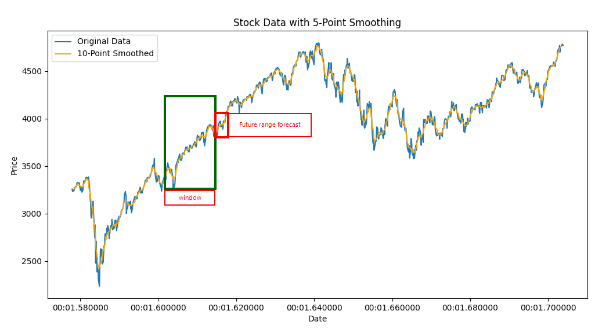
[切片生成训练、测试、预测数据](../src/GenTrainTestDataBig_fixlen_GRU_2.py)

### Create a GRU model
* [Generate GRU model and save to a file](../src/Test_GRUX3_fixlen_01.py)

🔔⚡️Experience
1. epoch: when loss does NOT go down, epoch size is enough.
2. Learning Rate: when loss changes back and forth, LR is too big; when loss changes too small, LR is too small.
3. no matter how to change LR, and epoch, the final loss almost fixed, means you are reach the best loss.

### Forcast Future Stock Price Range
* [forecast future stock normalized price range](../src/Test_GRUX3_fixlen_01_predict.py)

```
1. Load test data.
2. Create dataloader.
3. Load the saved model.
4. Evaluate the model on test data.
--------------- Test Results ---------------
Test Loss (MSE): 0.01390344
Mean Absolute Error (MAE): 0.07444746
R-squared (R2): 0.89404035
---------------------------------------------
1. Predict feture values.
Data shape: (10, 120, 5)
Targets shape: (10, 3)
----------------------------------------------------------------
Prediction for sequence 0: [0.17550081 0.18547772 0.19838372]
Real  data for sequence 0: [0.1769437  0.17068811 0.16907954]
----------------------------------------------------------------
Prediction for sequence 1: [0.91071075 0.9159886  0.9081013 ]
Real  data for sequence 1: [0.82054598 0.89281609 0.85747126]
----------------------------------------------------------------
Prediction for sequence 2: [0.90285707 0.90407133 0.88744545]
Real  data for sequence 2: [0.88318741 0.8823562  0.88252244]
----------------------------------------------------------------
Prediction for sequence 3: [0.94254965 0.935987   0.94824004]
Real  data for sequence 3: [0.96575879 1.         0.97637487]
----------------------------------------------------------------
Prediction for sequence 4: [0.25471193 0.2625934  0.29117215]
Real  data for sequence 4: [0.27425204 0.32887579 0.32524932]
----------------------------------------------------------------
Prediction for sequence 5: [0.9175505  0.91640943 0.8980696 ]
Real  data for sequence 5: [1.         0.98027574 0.9993962 ]
----------------------------------------------------------------
Prediction for sequence 6: [0.08631686 0.09392065 0.08612403]
Real  data for sequence 6: [0.13514782 0.19099015 0.36884092]
----------------------------------------------------------------
Prediction for sequence 7: [0.23528987 0.23136936 0.24292988]
Real  data for sequence 7: [0.06003752 0.12757974 0.17518762]
----------------------------------------------------------------
Prediction for sequence 8: [0.15681821 0.15669872 0.17343152]
Real  data for sequence 8: [0.06746301 0.06664857 0.        ]
----------------------------------------------------------------
Prediction for sequence 9: [0.95848805 0.94515836 0.9446089 ]
Real  data for sequence 9: [0.91780397 0.92152605 0.8560794 ]
```

## Activate Functions
