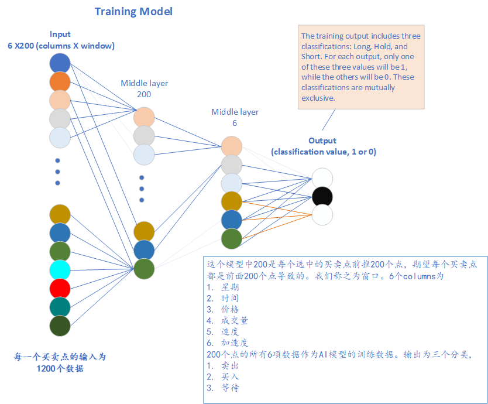

<h1>Idea of AI Stock Modeling</h1>

1. use boolinger line to determine long/short points(max:long, min:short value)
2. smooth (9, 15) all data, use the smoothed data as close[array]
3. calculate vilocity for all points(array)
4. calculate accelerate for all points(array)
5. use a window find stock input smooth data
6. create datasets: 
   a. input(close, vilocity, accelerate, weekdays, time, volume)
   b. output(long, short)
7. create model
8. use the model to test training data

## Idea of selecting long,short,hold points

🛠🎯 Leave this section for 周浩

* Concern and Issues
>
### Data Normalization

It is generally a good practice to normalize the input features, including price, when training a machine learning model for stock prediction. Normalization helps to scale the features to a similar range, which can improve the convergence of the model during training and prevent certain features from dominating others. Normalizing the input features can also make the model more robust to changes in the scale of the data.

However, the specific choice of normalization method can depend on the characteristics of your data and the model you are using. Common normalization techniques include min-max scaling (scaling to a range of [0, 1]) or standardization (scaling to have mean 0 and standard deviation 1). Experimenting with different normalization methods and observing the impact on the model's performance can help you determine the best approach for your stock prediction task.

## Create datasets


* [create datasets from stock raw data](../src/datasets.py)

## save and load datasets from file

* better file format

```csv
long,short,[(weekdays,time,close,slope,accelerate,volume),(...)]
0.1,0.2,0.3,0.4,0.5,0.6,0.7
0.2,0.3,0.4,0.5,0.6,0.8,0.9
0.3,0.4,0.5,0.6,0.7,0.5,0.4
...
```

## velocity and acceleration

$$v_i=\frac {c_{i+1}-c_{i-1}} {t_{i+1}-t_{i-1}}$$
i.e. the velocity at $t_i$ equals the difference of the "close" at $t_{i+1}$ and $t_{i-1}$. same as accelerate as below:
$$a_i=\frac {v_{i+1}-v_{i-1}} {t_{i+1}-t_{i-1}}$$

## Training and test data design

* csv file format
```
long,short,weekdays,time,price,volume,velocity,acceleration,...
1,0,2.0,10.0,503.039,2.3,0.12,1232,2.0,10.123,503.3,2.1,0.3,1354,...
1,0,2.0,10.0,503.039,2.3,0.12,1232,2.0,10.123,503.3,2.1,0.3,1354,...
... ...
```
[sample data file](../data/SPY_TraningData06.csv)
Sample format:
```csv
long,short,weekday,time,price,volume,velocity,acceleration,... ...
1,0,4.0000,10.1167,513.3700,230304.0000,-0.0600,0.1100,4.0000,10.1333,513.2700,389610.0000,-0.1000,-0.0400,4.0000,10.1500,513.2300,116196.0000,-0.0400,0.0600,4.0000,10.1667,513.0700,125490.0000,-0.1600,-0.1200,4.0000,10.1833,512.9400,308380.0000,-0.1300,0.0300,4.0000,10.2000,512.8300,153775.0000,-0.1100,0.0200,4.0000,10.2167,512.9300,191395.0000,0.1000,0.2100,4.0000,10.2333,512.7600,186673.0000,-0.1700,-0.2700,4.0000,10.2500,512.5800,243147.0000,-0.1800,-0.0100,4.0000,10.2667,512.3400,222841.0000,-0.2400,-0.0600
1,0,5.0000,15.1167,509.5700,91117.0000,-0.0400,-0.0500,5.0000,15.1333,509.5500,153922.0000,-0.0200,0.0200,5.0000,15.1500,509.4800,136941.0000,-0.0700,-0.0500,5.0000,15.1667,509.5900,115541.0000,0.1100,0.1800,5.0000,15.1833,509.5900,146988.0000,0.0000,-0.1100,5.0000,15.2000,509.5700,122923.0000,-0.0200,-0.0200,5.0000,15.2167,509.4300,163968.0000,-0.1400,-0.1200,5.0000,15.2333,509.3400,110492.0000,-0.0900,0.0500,5.0000,15.2500,509.2600,243777.0000,-0.0800,0.0100,5.0000,15.2667,509.2000,151465.0000,-0.0600,0.0200
...
0,1,4.0000,11.2333,503.6100,50585.0000,0.0400,0.0500,4.0000,11.2500,503.7300,168161.0000,0.1200,0.0800,4.0000,11.2667,503.8700,92983.0000,0.1400,0.0200,4.0000,11.2833,503.9000,221729.0000,0.0300,-0.1100,4.0000,11.3000,503.8400,129542.0000,-0.0600,-0.0900,4.0000,11.3167,503.7500,130294.0000,-0.0900,-0.0300,4.0000,11.3333,503.8200,84013.0000,0.0700,0.1600,4.0000,11.3500,503.9100,49237.0000,0.0900,0.0200,4.0000,11.3667,503.9600,259312.0000,0.0500,-0.0400,4.0000,11.3833,503.9700,92385.0000,0.0100,-0.0400
0,1,4.0000,15.4333,499.7100,180733.0000,0.0600,0.0000,4.0000,15.4500,499.7700,130763.0000,0.0600,0.0000,4.0000,15.4667,499.8200,110770.0000,0.0500,-0.0100,4.0000,15.4833,499.7900,105657.0000,-0.0300,-0.0800,4.0000,15.5000,499.8400,224877.0000,0.0500,0.0800,4.0000,15.5167,499.9200,147421.0000,0.0800,0.0300,4.0000,15.5333,499.9700,269021.0000,0.0500,-0.0300,4.0000,15.5500,500.0700,131807.0000,0.1000,0.0500,4.0000,15.5667,500.1400,149343.0000,0.0700,-0.0300,4.0000,15.5833,500.2500,164901.0000,0.1100,0.0400

```
* training dataset format 
trainingDataset.shape = [18,6,10]

```py
outputs_tensor = torch.tensor(outputs).reshape(18,2)
inputs_tensor = torch.tensor(inputs).reshape(18,1,6,10)
```
where 
1. 18 is total number of training data.
2. 2 in outputs_tensor is 1 demension 2 items array, ['long', 'short'].
3. 6 in inputs_tensor is 6 columns as (weekdays,time,close,velocity,acceleration,volume).
4. 10 in inputs_tensor is window size, which means we start from current time backwards for 10 data.

Sample input tensor
```
tensor([[[ 4.0000e+00,  1.0117e+01,  5.1337e+02,  ...,  1.0133e+01,
           5.1327e+02,  3.8961e+05],
         [-1.0000e-01, -4.0000e-02,  4.0000e+00,  ...,  6.0000e-02,
           4.0000e+00,  1.0167e+01],
         [ 5.1307e+02,  1.2549e+05, -1.6000e-01,  ...,  3.0838e+05,
          -1.3000e-01,  3.0000e-02],
         [ 4.0000e+00,  1.0200e+01,  5.1283e+02,  ...,  1.0217e+01,
           5.1293e+02,  1.9140e+05],
         [ 1.0000e-01,  2.1000e-01,  4.0000e+00,  ..., -2.7000e-01,
           4.0000e+00,  1.0250e+01],
         [ 5.1258e+02,  2.4315e+05, -1.8000e-01,  ...,  2.2284e+05,
          -2.4000e-01, -6.0000e-02]],

        [[ 5.0000e+00,  1.5117e+01,  5.0957e+02,  ...,  1.5133e+01,
           5.0955e+02,  1.5392e+05],
         [-2.0000e-02,  2.0000e-02,  5.0000e+00,  ..., -5.0000e-02,
           5.0000e+00,  1.5167e+01],
         [ 5.0959e+02,  1.1554e+05,  1.1000e-01,  ...,  1.4699e+05,
           0.0000e+00, -1.1000e-01],
         [ 5.0000e+00,  1.5200e+01,  5.0957e+02,  ...,  1.5217e+01,
           5.0943e+02,  1.6397e+05],
         [-1.4000e-01, -1.2000e-01,  5.0000e+00,  ...,  5.0000e-02,
           5.0000e+00,  1.5250e+01],
         [ 5.0926e+02,  2.4378e+05, -8.0000e-02,  ...,  1.5146e+05,
          -6.0000e-02,  2.0000e-02]],

        [[ 2.0000e+00,  1.0483e+01,  5.0329e+02,  ...,  1.0500e+01,
           5.0327e+02,  2.2177e+05],
         [-2.0000e-02,  9.0000e-02,  2.0000e+00,  ...,  2.0000e-02,
           2.0000e+00,  1.0533e+01],
         [ 5.0323e+02,  1.0411e+05, -4.0000e-02,  ...,  2.6403e+05,
          -8.0000e-02, -4.0000e-02],
         [ 2.0000e+00,  1.0567e+01,  5.0315e+02,  ...,  1.0583e+01,
           5.0307e+02,  9.7668e+04],
         [-8.0000e-02, -8.0000e-02,  2.0000e+00,  ..., -1.0000e-01,
           2.0000e+00,  1.0617e+01],
         [ 5.0271e+02,  2.7079e+05, -1.8000e-01,  ...,  1.4372e+05,
          -3.0000e-02,  1.5000e-01]],

        ...,

        [[ 3.0000e+00,  1.4600e+01,  5.0168e+02,  ...,  1.4617e+01,
           5.0171e+02,  7.9677e+04],
         [ 3.0000e-02,  1.3000e-01,  3.0000e+00,  ...,  9.0000e-02,
           3.0000e+00,  1.4650e+01],
         [ 5.0207e+02,  9.1089e+04,  2.4000e-01,  ...,  9.8564e+04,
           3.2000e-01,  8.0000e-02],
         [ 3.0000e+00,  1.4683e+01,  5.0288e+02,  ...,  1.4700e+01,
           5.0323e+02,  4.1820e+05],
         [ 3.5000e-01, -1.4000e-01,  3.0000e+00,  ..., -1.0000e-02,
           3.0000e+00,  1.4733e+01],
         [ 5.0372e+02,  2.0590e+05,  1.5000e-01,  ...,  2.3435e+05,
           1.8000e-01,  3.0000e-02]],

        [[ 4.0000e+00,  1.1233e+01,  5.0361e+02,  ...,  1.1250e+01,
           5.0373e+02,  1.6816e+05],
         [ 1.2000e-01,  8.0000e-02,  4.0000e+00,  ...,  2.0000e-02,
           4.0000e+00,  1.1283e+01],
         [ 5.0390e+02,  2.2173e+05,  3.0000e-02,  ...,  1.2954e+05,
          -6.0000e-02, -9.0000e-02],
         [ 4.0000e+00,  1.1317e+01,  5.0375e+02,  ...,  1.1333e+01,
           5.0382e+02,  8.4013e+04],
         [ 7.0000e-02,  1.6000e-01,  4.0000e+00,  ...,  2.0000e-02,
           4.0000e+00,  1.1367e+01],
         [ 5.0396e+02,  2.5931e+05,  5.0000e-02,  ...,  9.2385e+04,
           1.0000e-02, -4.0000e-02]],

        [[ 4.0000e+00,  1.5433e+01,  4.9971e+02,  ...,  1.5450e+01,
           4.9977e+02,  1.3076e+05],
         [ 6.0000e-02,  0.0000e+00,  4.0000e+00,  ..., -1.0000e-02,
           4.0000e+00,  1.5483e+01],
         [ 4.9979e+02,  1.0566e+05, -3.0000e-02,  ...,  2.2488e+05,
           5.0000e-02,  8.0000e-02],
         [ 4.0000e+00,  1.5517e+01,  4.9992e+02,  ...,  1.5533e+01,
           4.9997e+02,  2.6902e+05],
         [ 5.0000e-02, -3.0000e-02,  4.0000e+00,  ...,  5.0000e-02,
           4.0000e+00,  1.5567e+01],
         [ 5.0014e+02,  1.4934e+05,  7.0000e-02,  ...,  1.6490e+05,
           1.1000e-01,  4.0000e-02]]])
```

sample training output tensor

```
tensor([[1., 0.],
        [1., 0.],
        [1., 0.],
        [1., 0.],
        [1., 0.],
        [1., 0.],
        [1., 0.],
        [1., 0.],
        [1., 0.],
        [0., 1.],
        [0., 1.],
        [0., 1.],
        [0., 1.],
        [0., 1.],
        [0., 1.],
        [0., 1.],
        [0., 1.],
        [0., 1.]])
```
index=0, 表明该窗口数据属于long类。index=1，表面该窗口数据属于short类。

预测结果实例：
predict=[-0.27,3.45]
由于index=1的数字更大，表明该输入数据被认定为short。

* test dataset format
test datasets 和training datasets两者的输入结构是相同的，但是输出的结构是不同的。对于训练用的数据，输出部分也是一个二维矩阵（见上面的实际例子），表示该给定窗口数据的分类，或者是long，或者是short，用[1,0]表示设定为long，用[0,1]设定为short。 
而test数据的输出，只是一个一维矩阵，包含每个窗口的正确结果所处的位置（index）。对于上面给出的18行的数据，测试Tensor看起来应该是这样的：
[0,0,0,0,0,0,0,0,0,1,1,1,1,1,1,1,1,1]
他表示前8行属于0类，也就是long类；后8行属于1类，也就是short类。
在我们的程序中是通过下面的程序段达到这样的效果。


```py
test_output_tensor = torch.tensor([int(y == 1.0) for x, y in outputs])
```
这里巧妙地应用了将bool数据转换成整数的方法，也就是int(True)为1，int(Fale)为0.还要注意到我们的long和short是相关的，x=1则y=0,反之亦然。所以程序中只使用了y的值，就得到了正确的测试输出数组。

👍😄 **Conclusion**
运行
* [read stock data, build model, save model to a file，stock.py](../src/stock.py)


```py input data
file_path = 'stockdata/SPY_TraningData_30_07.csv'
```

❌😢<font style="background-color:yellow">仅仅得到50%的精准度，表明这样的数据结构和NN模型是完全不能够预测股票走势的。</font>

[use model file to predict stock data(which is same as the trainging data)](../src/stock1.py)


```
tensor([[1., 0.,0],
        [1., 0.,0],
        [1., 0.,0],
        [0., 0.,1],
        [0.,1,0.],
        ...
        [0., 1.]])
```
* [load model from file built by stock.py, use the model to test](../src/stock1.py)

```py input data
file_path = 'stockdata/SPY_TraningData_30_07.csv'
```


```text
(env) C:\Users\wangq\workspace\LearnTorch>c:/Users/wangq/workspace/LearnTorch/env/Scripts/python.exe c:/Users/wangq/workspace/LearnTorch/src/stock1.py
18
18 180
window: 30
Predicted: "long", Actual: "long"
Predicted: "long", Actual: "long"
Predicted: "long", Actual: "long"
Predicted: "long", Actual: "long"
Predicted: "long", Actual: "long"
Predicted: "long", Actual: "long"
Predicted: "short", Actual: "long"
Predicted: "long", Actual: "long"
Predicted: "short", Actual: "long"
Predicted: "short", Actual: "short"
Predicted: "short", Actual: "short"
Predicted: "short", Actual: "short"
Predicted: "short", Actual: "short"
Predicted: "short", Actual: "short"
Predicted: "short", Actual: "short"
Predicted: "short", Actual: "short"
Predicted: "short", Actual: "short"
Predicted: "long", Actual: "short"
accuracy: 83.33
```

👍😄 令人可喜的结论：
> 一旦模型保存在文件中，重复使用的精度是一直保持着的。

👎😢 可悲的是：
> 训练数据和测试数据完全相同的情况下，精度应该是100%才对。
> 1. window=30 太小
> 2. 只有18个点，训练数据太少。
> 3. 线性模型不够好？

🔔⚡️ <font style="background-color:yellow">偶然发现的buy的测试比sell的测试更精确的现象是不存在的。根据目前的结果，两者没有差异。</font>

* [plot one window data with Velocity or Accelaration, stock2.py](../src/stock2.py)

* [read training and testing data separately, stock4.py](../src/stock4.py)
  
## Add Weights on Data

* [add linear weights on Data, stock5.py](../src/stock5.py)

如果训练数据不包括测试数据（stockdata/SPY_TrainingData_200_09.csv, 53points），精度较低，最高只达到84%。

如果训练数据包括测试数据（stockdata/SPY_TrainingData_200_10.csv, 65points），精度较高，最高可达到100%。

```text 线性加权
Epoch 19********************
loss: 3.667773  [    5/   65]
loss: 0.000000  [   30/   65]
loss: 0.000000  [   55/   65]
Test Error: 
 Accuracy: 100.0%, Avg loss: 0.000000

Epoch 20********************
loss: 3.534004  [    5/   65]
loss: 0.000000  [   30/   65]
loss: 0.000000  [   55/   65]
Test Error:
 Accuracy: 100.0%, Avg loss: 0.000000

Done with training.
Saved PyTorch Model State to stock_model_200_10_100_linearWeighted.pth
```

* [add exponential weights on Data and normalization](../src/stock6.py)
1. 原始价格，最好精度=92%
2. 只归一，最好精度=66%
3. 归一加指数权重，最好精度=60%

👍😄 **Conclusion**

> 感觉使用原始数据所做的模型精度，远好于归一化后的数据。
> 加权后并没有改进精度。
> 因为我们并没有与其他数据作比对，所以归一化应该没有任何影响才对。😢😢

* [comparison of linear and exponential weights](../src/stock7.py)


## Add hold as output as [long, hold, short]



💡👉 Idea of selecting hold points
1. between long and short, evenly select 3 or 5 points as hold points.

* [add hold to classify long and short](../src/stock8.py)

## Available Models


### 卷积神经网络

* [卷积神经网络](../src/cnn.py)

### Recurrent Neural Network

* [Recurrent Neural Network](../src/rnn.py)
* 
### Attension Machanics

* [Attension Machanics](../src/attention.py)

### Transform 模型

* [](../src/transform.py)

### AutoEncoders

* [](../src/autoencoder.py)
* [](../src/autoencoder2.py)

### 生成对抗网络

* [understand what it is](../src/gan.py)
* [Successful](../src/gan1.py)

### Reinforcement Learning

* [Need use real data](../src/reinforcement.py)