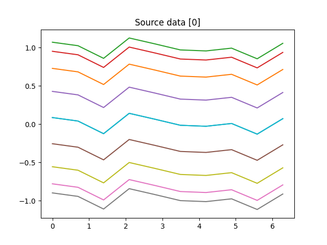
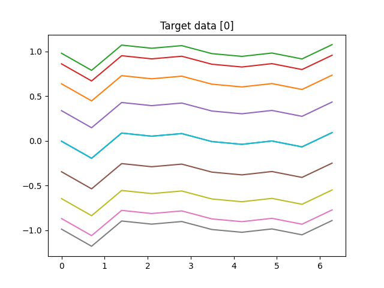

This code is an implementation of a Transformer-based neural network model for time series forecasting. Let's go through the key components and steps:

### Step 1: Load and Process the CSV Data
The `load_data` function loads a CSV file containing time series data. It separates the data into two lists (`low_data` and `high_data`) based on prefixes `[1, 0]` and `[0, 1]` respectively, indicating different classes or types of time series.

### Step 2: Create a Custom Dataset
The `VariableLengthTimeSeriesDataset` class is a custom PyTorch `Dataset` that stores the time series sequences. It implements methods to get the length of the dataset (`__len__`) and to retrieve individual sequences (`__getitem__`).

### Step 3: Collate Function for Padding Sequences
The `collate_fn` function is used by the `DataLoader` to pad sequences within each batch to ensure they have the <font style="background-color:yellow">same length</font>. It also creates a mask tensor to distinguish padded elements from real data during computation.

### Transformer Model Definition
The `TimeSeriesTransformer` class defines the Transformer model using PyTorch's `nn.Transformer`. Key components include:
- **Embedding Layer:** Maps input sequences to a higher-dimensional space (`d_model`).
- **Transformer:** Composed of encoder and decoder layers that process sequences and perform self-attention and feedforward operations.
- **Output Layer:** Linear layer (`fc_out`) to produce the final output.

### Hyperparameters
Defined hyperparameters include the model input size (`input_size`), embedding dimension (`d_model`), number of attention heads (`nhead`), layers in the encoder and decoder (`num_encoder_layers`, `num_decoder_layers`), feedforward dimension (`dim_feedforward`), output size (`output_size`), and dropout rate (`dropout`).

### Training Loop
The training loop (`for epoch in range(num_epochs)`) iterates over the specified number of epochs. Within each epoch:
- Batches from `low_dataloader` and `high_dataloader` (for different types of data) are fetched simultaneously.
- Each batch is prepared (`batch` is expanded with an additional dimension), and subsequent masks are created using `create_subsequent_mask` to prevent attending to future elements during training.
- The model is optimized using Adam optimizer, and loss is computed using Mean Squared Error (`nn.MSELoss`).
- Backpropagation (`loss.backward()`) and parameter update (`optimizer.step()`) are performed.
- Average loss per epoch and training duration are printed.

### Save the Model
After training, the model's state dictionary (`model.state_dict()`) is saved to a file (`timeseries_transformer.pth`) for future use.

### Summary
This code demonstrates how to implement and train a Transformer-based neural network model for time series forecasting tasks using PyTorch. It handles variable-length sequences, utilizes padding and masking techniques, and defines a custom dataset and collate function to work with DataLoader efficiently. Adjustments such as hyperparameter tuning and further customization can be made based on specific requirements or dataset characteristics.

```py
class TimeSeriesTransformer(nn.Module):
    def __init__(self, input_size, d_model, nhead, num_encoder_layers, num_decoder_layers, dim_feedforward, output_size, dropout=0.1):
        super(TimeSeriesTransformer, self).__init__()
        self.embedding = nn.Linear(input_size, d_model)
        self.transformer = nn.Transformer(
            d_model, nhead, num_encoder_layers, num_decoder_layers, dim_feedforward, dropout, batch_first=True
        )
        self.fc_out = nn.Linear(d_model, output_size)

    def forward(self, src, tgt, src_mask=None, tgt_mask=None, src_key_padding_mask=None, tgt_key_padding_mask=None):
        src = self.embedding(src)
        tgt = self.embedding(tgt)
        output = self.transformer(
            src, tgt, src_mask=src_mask, tgt_mask=tgt_mask,
            src_key_padding_mask=src_key_padding_mask, tgt_key_padding_mask=tgt_key_padding_mask
        )
        output = self.fc_out(output)
        return output

```

The `TimeSeriesTransformer` class is a PyTorch implementation of a transformer model designed for time series forecasting. Here's a detailed breakdown of how the model works:

### Components of the Model

1. **Embedding Layer**:
   - `self.embedding = nn.Linear(input_size, d_model)`
   - This is a linear layer that projects the input features (time series data) to a higher-dimensional space (`d_model`). This step is crucial because the transformer expects input data to have a specific dimension (`d_model`).

2. **Transformer**:
   - `self.transformer = nn.Transformer(d_model, nhead, num_encoder_layers, num_decoder_layers, dim_feedforward, dropout, batch_first=True)`
   - This is the core component of the model, which uses the transformer architecture. It consists of:
     - `d_model`: The dimension of the embedding space.
     - `nhead`: The number of attention heads in the multi-head attention mechanism.
     - `num_encoder_layers`: The number of layers in the encoder.
     - `num_decoder_layers`: The number of layers in the decoder.
     - `dim_feedforward`: The dimension of the feedforward network within each transformer layer.
     - `dropout`: The dropout rate for regularization.
     - `batch_first=True`: Ensures that the input tensors have the batch size as the first dimension.

3. **Output Layer**:
   - `self.fc_out = nn.Linear(d_model, output_size)`
   - This is a linear layer that maps the transformer's output to the desired output size, which corresponds to the number of predicted time series values.

### Forward Method

The `forward` method defines how the input data passes through the model during the forward pass:

1. **Embedding the Input**:
   - `src = self.embedding(src)`
   - `tgt = self.embedding(tgt)`
   - The source (`src`) and target (`tgt`) time series data are passed through the embedding layer to project them to the `d_model` dimensional space.

2. **Passing Through the Transformer**:
   - `output = self.transformer(src, tgt, src_mask=src_mask, tgt_mask=tgt_mask, src_key_padding_mask=src_key_padding_mask, tgt_key_padding_mask=tgt_key_padding_mask)`
   - The embedded source and target sequences are fed into the transformer. The transformer uses self-attention and cross-attention mechanisms to capture dependencies within the sequences. Optional masks (`src_mask`, `tgt_mask`, `src_key_padding_mask`, `tgt_key_padding_mask`) can be provided to handle padding and attention masking.

3. **Generating the Final Output**:
   - `output = self.fc_out(output)`
   - The transformer's output is passed through the final linear layer to obtain the predictions.

### Usage

- **src**: The input time series data for the encoder.
- **tgt**: The target time series data for the decoder.
- **src_mask, tgt_mask**: Optional masks to apply on the source and target sequences during attention.
- **src_key_padding_mask, tgt_key_padding_mask**: Optional masks to ignore padding tokens in the source and target sequences.

This model is designed to handle tasks where you need to predict future values of a time series based on past values. The transformer architecture allows it to capture complex temporal dependencies effectively.

Yes, there is significant mathematical computation involved in the `TimeSeriesTransformer` model, especially in the core transformer architecture. Here's a brief overview of the key mathematical concepts and operations:

### 1. Linear Embedding
\[ \text{embedding}(x) = xW + b \]
Where \( x \) is the input tensor, \( W \) is the weight matrix, and \( b \) is the bias.

### 2. Multi-Head Self-Attention
The self-attention mechanism computes the attention scores and uses them to weigh the input features.

#### a. Scaled Dot-Product Attention
For a single attention head:
\[ \text{Attention}(Q, K, V) = \text{softmax}\left(\frac{QK^T}{\sqrt{d_k}}\right) V \]
Where:
- \( Q \) (query) is the projected input sequence.
- \( K \) (key) is the projected input sequence.
- \( V \) (value) is the projected input sequence.
- \( d_k \) is the dimension of the key vectors.

#### b. Multi-Head Attention
Multi-head attention allows the model to jointly attend to information from different representation subspaces:
\[ \text{MultiHead}(Q, K, V) = \text{Concat}(\text{head}_1, \text{head}_2, \ldots, \text{head}_h)W^O \]
Where each head \( \text{head}_i \) is a separate attention operation:
\[ \text{head}_i = \text{Attention}(QW_i^Q, KW_i^K, VW_i^V) \]
Here, \( W_i^Q \), \( W_i^K \), and \( W_i^V \) are projection matrices for the queries, keys, and values for head \( i \).

### 3. Position-Wise Feed-Forward Networks
Each position in the sequence is passed through a fully connected feed-forward network:
\[ \text{FFN}(x) = \text{max}(0, xW_1 + b_1)W_2 + b_2 \]
Where \( W_1 \) and \( W_2 \) are weight matrices, and \( b_1 \) and \( b_2 \) are biases.

### 4. Residual Connections and Layer Normalization
Residual connections are used around each sub-layer (attention and feed-forward):
\[ \text{LayerNorm}(x + \text{Sublayer}(x)) \]
Layer normalization helps stabilize the training:
\[ \text{LayerNorm}(x) = \frac{x - \mu}{\sigma + \epsilon} \cdot \gamma + \beta \]
Where \( \mu \) is the mean, \( \sigma \) is the standard deviation, \( \epsilon \) is a small constant for numerical stability, and \( \gamma \) and \( \beta \) are learnable parameters.

### 5. Transformer Encoder and Decoder
The encoder and decoder each consist of multiple layers of the above components:
- Encoder layer: multi-head attention + feed-forward network.
- Decoder layer: masked multi-head attention (to prevent attending to future positions), multi-head attention over the encoder's output, and feed-forward network.

### 6. Output Linear Layer
Finally, the output from the transformer is projected back to the desired output size:
\[ \text{output}(x) = xW + b \]
Where \( W \) is the weight matrix, and \( b \) is the bias.

### Summary
The `TimeSeriesTransformer` leverages these mathematical operations to learn and predict time series data. The attention mechanism allows it to weigh different parts of the input sequence differently, capturing temporal dependencies effectively. The feed-forward networks and residual connections ensure robust learning and stable gradients.

## Mask
Masks play a crucial role in the transformer model, especially for handling sequences of varying lengths and for autoregressive tasks like time series forecasting. There are different types of masks used in the transformer model:

### 1. Padding Mask
A padding mask is used to ensure that the padding tokens (added to make sequences in a batch the same length) do not influence the model's computations. This mask is applied in both the encoder and the decoder.

#### How it works:
- The mask is a binary tensor with the same shape as the input sequence, where 1 indicates a valid token, and 0 indicates a padding token.
- When applied, the mask prevents the attention mechanism from considering the padding tokens by setting their attention scores to a very low value (negative infinity).

### 2. Sequence Mask
A sequence mask (or look-ahead mask) is used in the decoder to prevent positions from attending to subsequent positions. This is essential for autoregressive tasks like time series forecasting, where you want the model to predict the next value based only on the known preceding values.

#### How it works:
- The mask is a binary tensor with the shape [sequence_length, sequence_length], where the upper triangular part (above the diagonal) is filled with 0s, and the rest with 1s.
- This mask ensures that each position in the sequence can only attend to previous positions (and itself), not to future positions.

### Applying Masks in the Transformer

In the transformer architecture, masks are applied during the attention computation. Let's break down how this works with the formula for scaled dot-product attention:

\[ \text{Attention}(Q, K, V) = \text{softmax}\left(\frac{QK^T}{\sqrt{d_k}} + M\right)V \]

Here, \( M \) is the mask, which can be either a padding mask or a sequence mask.

- **Padding Mask**: 
  - This mask is added to the attention scores before applying the softmax function.
  - The padding positions in the mask are set to a very low value (e.g., \(-\infty\)), which, after softmax, results in nearly zero attention weights for those positions.

- **Sequence Mask**:
  - This mask is also added to the attention scores.
  - The future positions in the mask are set to a very low value, ensuring that the softmax function assigns zero weight to these positions, effectively ignoring them during prediction.

### Example in PyTorch

Here's an example of how masks can be implemented and applied in a PyTorch transformer model:

```python
import torch
import torch.nn as nn

# Create a sample transformer model
class TimeSeriesTransformer(nn.Module):
    def __init__(self, input_size, d_model, nhead, num_encoder_layers, num_decoder_layers, dim_feedforward, output_size, dropout=0.1):
        super(TimeSeriesTransformer, self).__init__()
        self.embedding = nn.Linear(input_size, d_model)
        self.transformer = nn.Transformer(
            d_model, nhead, num_encoder_layers, num_decoder_layers, dim_feedforward, dropout, batch_first=True
        )
        self.fc_out = nn.Linear(d_model, output_size)

    def forward(self, src, tgt, src_mask=None, tgt_mask=None, src_key_padding_mask=None, tgt_key_padding_mask=None):
        src = self.embedding(src)
        tgt = self.embedding(tgt)
        output = self.transformer(
            src, tgt, src_mask=src_mask, tgt_mask=tgt_mask,
            src_key_padding_mask=src_key_padding_mask, tgt_key_padding_mask=tgt_key_padding_mask
        )
        output = self.fc_out(output)
        return output

# Sample input data
batch_size = 2
sequence_length = 5
input_size = 3
d_model = 4

src = torch.rand((batch_size, sequence_length, input_size))
tgt = torch.rand((batch_size, sequence_length, input_size))

# Create padding mask
src_key_padding_mask = (src.sum(dim=-1) == 0)
tgt_key_padding_mask = (tgt.sum(dim=-1) == 0)

# Create sequence mask
tgt_mask = nn.Transformer.generate_square_subsequent_mask(sequence_length)

# Instantiate and forward pass through the model
model = TimeSeriesTransformer(input_size, d_model, nhead=2, num_encoder_layers=2, num_decoder_layers=2, dim_feedforward=16, output_size=1)
output = model(src, tgt, tgt_mask=tgt_mask, src_key_padding_mask=src_key_padding_mask, tgt_key_padding_mask=tgt_key_padding_mask)

print(output)
```

### Summary
Masks are critical for:
- Ensuring that padding tokens do not affect the model's computations.
- Preventing the model from looking ahead in the sequence during autoregressive tasks, maintaining the causality of time series data.

By applying masks appropriately, the transformer model can effectively handle variable-length sequences and perform accurate time series forecasting.


## Sample Mask Usage
Let's create a complete example with sample data to demonstrate how to use the `TimeSeriesTransformer` class. This example will include generating synthetic time series data, preparing masks, and making predictions using the transformer model.

### Step-by-Step Example

1. **Generate Synthetic Time Series Data**
2. **Prepare Masks**
3. **Define and Train the Model**
4. **Make Predictions**

#### Step 1: Generate Synthetic Time Series Data

We'll create a simple synthetic time series dataset for demonstration purposes.

[Generate source and target data](../src/mask01.py)



#### Step 2: Prepare Masks

We'll create padding and sequence masks. For simplicity, we'll assume no padding is required in this example.

[Generate target mask tensor 10X10 matrix](../src/mask02.py)

#### Step 3: Define and Train the Model

We'll define the transformer model and run a few training iterations to demonstrate the process.

[traning the model](../src/mask03.py)

```output
(env) C:\Users\wangq\workspace\LearnTorch>c:/Users/wangq/workspace/LearnTorch/env/Scripts/python.exe c:/Users/wangq/workspace/LearnTorch/src/mask03.py
Epoch [10/100], Loss: 0.5146
Epoch [20/100], Loss: 0.2651
Epoch [30/100], Loss: 0.1077
Epoch [40/100], Loss: 0.0686
Epoch [50/100], Loss: 0.0401
Epoch [60/100], Loss: 0.0388
Epoch [70/100], Loss: 0.0258
Epoch [80/100], Loss: 0.0236
Epoch [90/100], Loss: 0.0229
Epoch [100/100], Loss: 0.0221
Training complete.

```

#### Step 4: Make Predictions

After training, we'll use the model to make predictions.

[prediction based on the model](../src/mask04.py)

```python
# Set the model to evaluation mode
model.eval()

# Generate new synthetic data for testing
test_src_data = generate_synthetic_data(seq_len, num_features, batch_size)

# Make predictions
with torch.no_grad():
    predictions = model(test_src_data, test_src_data, tgt_mask=tgt_mask, src_key_padding_mask=src_key_padding_mask, tgt_key_padding_mask=tgt_key_padding_mask)

print("Predictions:", predictions)
```

### Summary

This example demonstrates how to generate synthetic time series data, prepare masks, define and train the `TimeSeriesTransformer` model, and make predictions. The model learns to map the input time series data (`src_data`) to the target time series data (`tgt_data`) through the transformer architecture.

## Accuracy

To determine how accurate your predictions are in a time series forecasting scenario, you typically use evaluation metrics that are suitable for regression tasks. Here are a few commonly used metrics you can consider:

1. **Mean Squared Error (MSE)**: This measures the average of the squares of the errors—that is, the average squared difference between the predicted values and the actual values. Lower values indicate better performance.

   ```python
   from sklearn.metrics import mean_squared_error

   # Assuming 'output' is your predicted tensor and 'tgt_data' is your target tensor
   mse = mean_squared_error(output.detach().numpy(), tgt_data.numpy())
   ```

2. **Root Mean Squared Error (RMSE)**: This is the square root of the MSE and provides a measure of the standard deviation of the prediction errors. Like MSE, lower values are better.

   ```python
   rmse = np.sqrt(mse)
   ```

3. **Mean Absolute Error (MAE)**: This measures the average absolute difference between predicted and actual values. It gives you an idea of the magnitude of the error, regardless of direction.

   ```python
   from sklearn.metrics import mean_absolute_error

   mae = mean_absolute_error(output.detach().numpy(), tgt_data.numpy())
   ```

4. **R-squared (Coefficient of Determination)**: This metric indicates how well the predicted values fit the actual data. It ranges from 0 to 1, with 1 indicating a perfect fit.

   ```python
   from sklearn.metrics import r2_score

   r2 = r2_score(tgt_data.numpy(), output.detach().numpy())
   ```

### Example Usage

Here's how you can integrate these metrics into your training loop to evaluate the performance of your model:

```python
# Training loop (with evaluation)
num_epochs = 100
for epoch in range(num_epochs):
    model.train()
    optimizer.zero_grad()
    output = model(src_data, tgt_data, tgt_mask=tgt_mask, src_key_padding_mask=src_key_padding_mask, tgt_key_padding_mask=tgt_key_padding_mask)
    loss = criterion(output, tgt_data)
    loss.backward()
    optimizer.step()

    # Evaluation on validation set or using test set
    if (epoch + 1) % 10 == 0:
        model.eval()
        with torch.no_grad():
            val_output = model(val_src_data, val_tgt_data, tgt_mask=val_tgt_mask, src_key_padding_mask=val_src_key_padding_mask, tgt_key_padding_mask=val_tgt_key_padding_mask)
            val_loss = criterion(val_output, val_tgt_data)
            
            # Calculate metrics
            val_mse = mean_squared_error(val_output.detach().numpy(), val_tgt_data.numpy())
            val_rmse = np.sqrt(val_mse)
            val_mae = mean_absolute_error(val_output.detach().numpy(), val_tgt_data.numpy())
            val_r2 = r2_score(val_tgt_data.numpy(), val_output.detach().numpy())
            
            print(f'Epoch [{epoch + 1}/{num_epochs}], Loss: {loss.item():.4f}, Val Loss: {val_loss.item():.4f}')
            print(f'Val MSE: {val_mse:.4f}, Val RMSE: {val_rmse:.4f}, Val MAE: {val_mae:.4f}, Val R2: {val_r2:.4f}')

print("Training complete.")
```

### Interpretation

- **Loss**: Monitor both training loss and validation loss to ensure the model is learning effectively.
- **Metrics**: Use MSE, RMSE, MAE, and R-squared to understand how well your model predicts the target values compared to the actual data.
- **Overfitting**: If the training loss decreases while the validation loss increases or remains stagnant, it could indicate overfitting, where the model learns to memorize the training data rather than generalize.

By evaluating these metrics regularly during training and on separate validation or test data sets, you can gain insights into the predictive performance of your time series transformer model. Adjustments to model architecture, hyperparameters, or training strategies can then be made based on these evaluations to improve accuracy and generalization.
