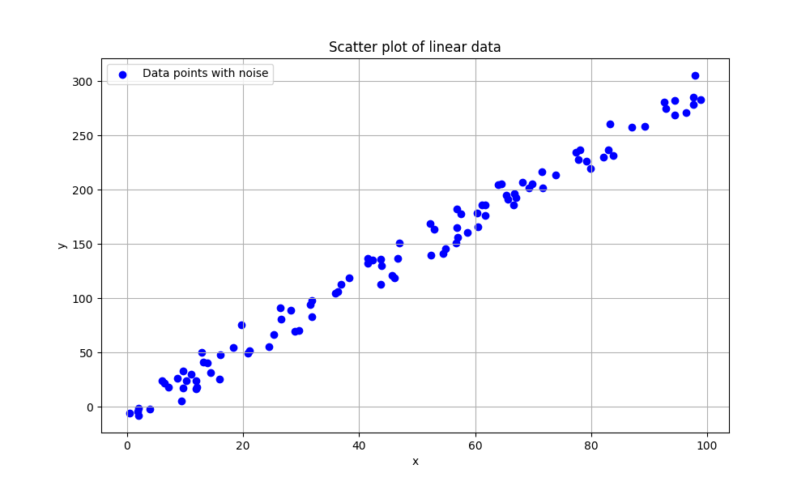
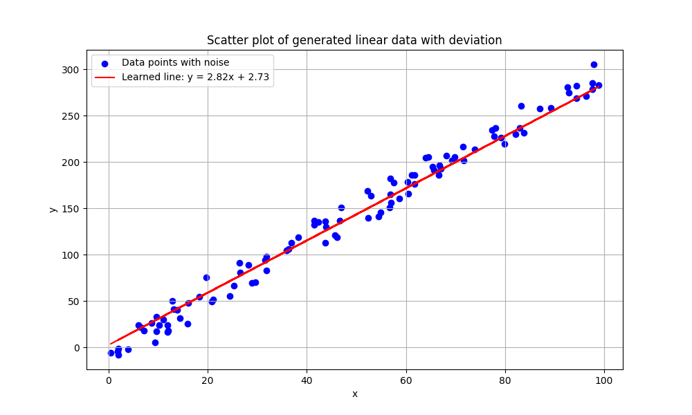
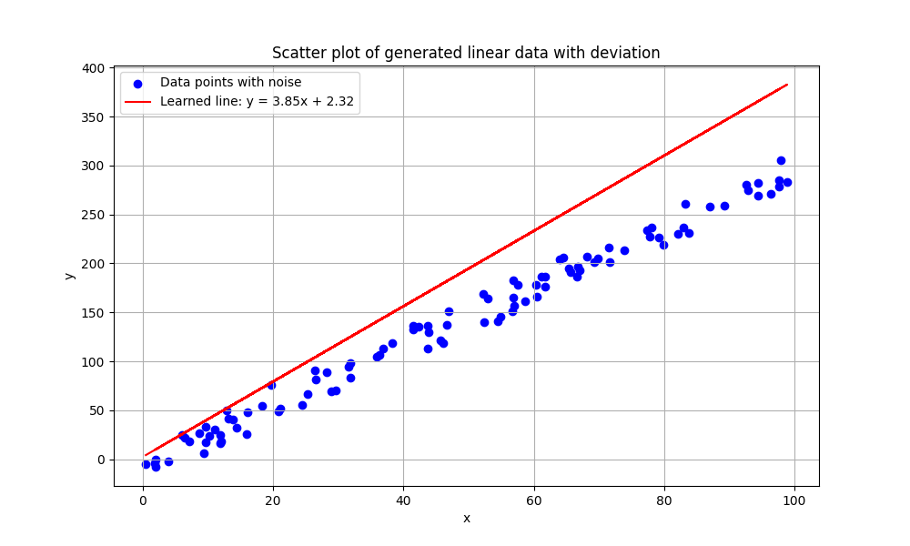
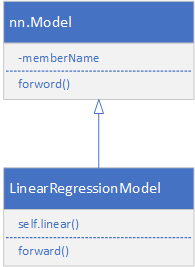
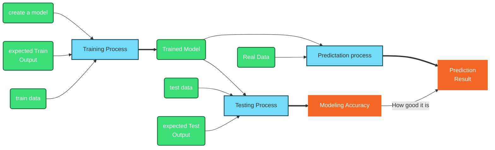
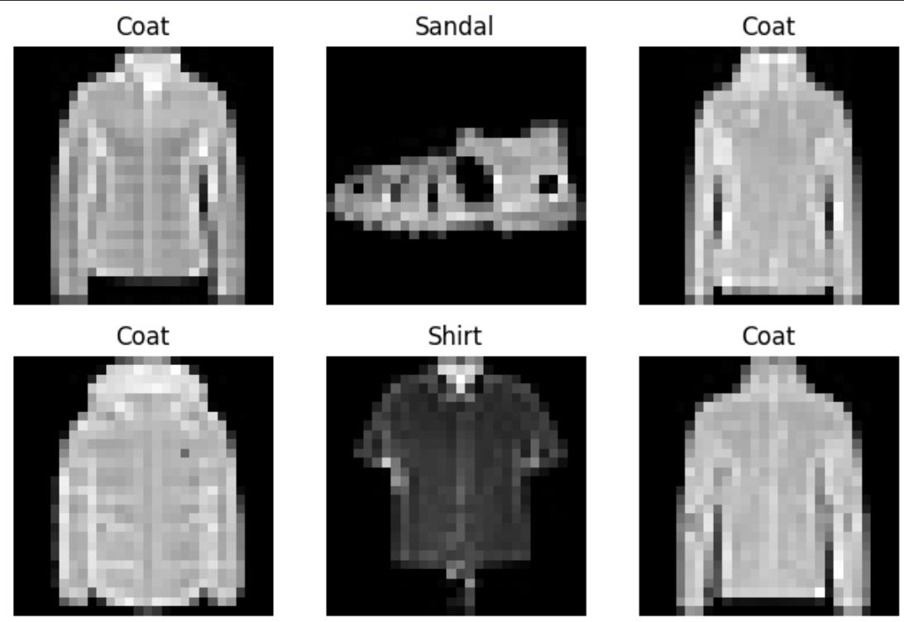
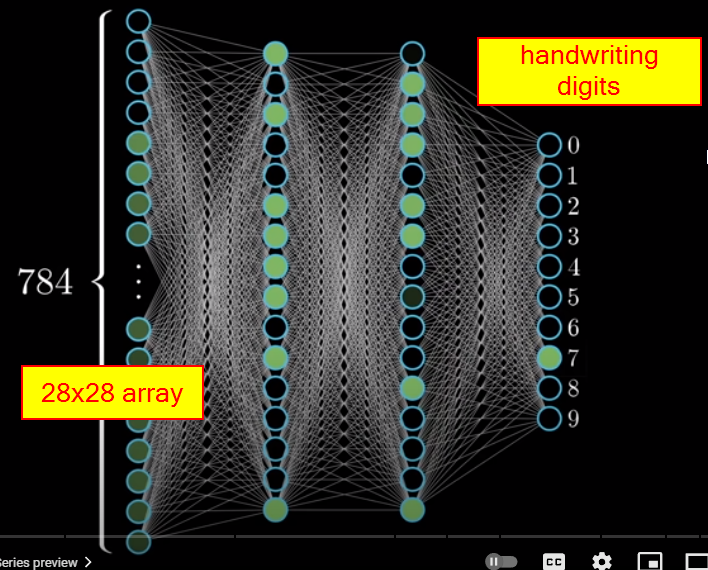

<h1>PyTorch Learning Notes</h1>

```
👍😄 事物可以预测，是因为事物本身遵循一定的客观规律。
Things can be predicted because things themselves follow certain objective laws.
```
> 因果关系和相关性是两个不同的概念：
>【因果关系】（Causation）：指的是一种事件或行为导致另一种事件或行为发生的关系。在因果关系中，一个事件被认为是另一个事件的原因，因此，它们之间存在着时间上的顺序和因果联系。因果关系通常被描述为“如果...那么...”的形式，即如果发生事件A，则事件B将会发生。
>【相关性】（Correlation）：指的是两个或多个变量之间的关系，当一个变量发生变化时，另一个变量也可能随之发生变化。然而，相关性并不意味着其中一个变量的变化是另一个变量变化的原因。相关性只是描述了变量之间的关系，而不提供有关这种关系的原因的信息。
因此，尽管相关性可以显示出两个变量之间的关联程度，但要确认一个变量是否导致另一个变量变化，通常需要更多的研究和证据来确定因果关系是否存在。因果关系的确认需要排除其他可能的解释，并确保所观察到的关联是真正的因果联系，而不是简单的相关性。

如果有10个原因造成一个结果，在这种情况下，我们只知道造成结果的一部分原因，而不是全部原因。如果我们只知道其中6个原因，那么这些原因和结果之间可能存在因果关系，也可能存在相关性，或者两者兼有。

【因果关系】：如果这6个已知的原因中的某些因素确实是导致结果发生的原因，并且其他未知的原因不会改变这个结果，那么我们可以说存在因果关系。
【相关性】：即使我们不知道全部的原因，这6个已知的原因可能与结果之间存在相关性。也就是说，这6个因素的变化可能会与结果的变化相关联，即使它们不是直接的原因。
因此，根据我们对原因的了解程度以及这些因素与结果之间的关系，我们可能会说这些原因与结果之间存在一定程度的因果关系或相关性。

<font style="background-color:yellow">即使我们只能提供其中的一部分因素，AI模型也可以尝试预测股票的涨跌。</font>机器学习和人工智能模型能够从提供的数据中学习模式和趋势，并试图预测未来的股票价格变动。然而，这种预测的准确性取决于多种因素，包括提供的数据质量、模型的复杂性、训练数据的时间跨度和可用性等。

在现实世界中，股票市场受到许多不确定因素的影响，如经济状况、政治事件、自然灾害等，这些因素可能会使股票价格的变动变得复杂和难以预测。因此，即使使用了AI模型，对股票价格的准确预测仍然是一个具有挑战性的问题。

❓ Factors affecting stock market?
* [Factors affecting stock market](https://www.adityabirlacapital.com/abc-of-money/factors-affecting-stock-market#2)
> 1. Supply and demand
> 2. Company related factors
> 3. Investor sentiment (What kind of sentiment of investors?)
> 4. Interest rates
> 5. Politics
> 6. Current events
> 7. Natural calamities
> 8. Exchange rates

## Getting Started

1. set local virtual environment (env)
python -m venv env
2. pip install torch

## Errors
❓ not available module

📝 close VS Code, reopen, and run all code from the top.

## Linear Modeling

* [generate linear model with noise](../src/genLinear.py)
  $$y=f(x)=3\cdot x - 7 + noise$$
* [read data from file and plot it](../src/plotLinear.py)

* [create a linear model based on data](../src/linearModel.py)



👍😄 **Conclusion**
1. linear model does NOT give exactly we expected.
2. lr (learning rate) is kind of sensitive
3. epoch make difference


### Model class

```py
# Step 2: Build and Train the Neural Network Model
# Define the neural network model
class LinearRegressionModel(nn.Module):
    def __init__(self):
        super(LinearRegressionModel, self).__init__()
        self.linear = nn.Linear(1, 1)
    
    def forward(self, x):
        return self.linear(x)
```



### Training process


## AI on Fashion


28X28=784 input, 2 modle layer,  0-9 output
$$f_{l+1} = \sigma (w_l a_l + b_l) $$
$w_l$: weight for layer l
$b_l$: bias for layer l
$\sigma$: activation function
$f_{l+1}$: l+1 function of layer l
the purpose of modeling is find each $w_l$ and $b_l$
$$f=\sum_{l=0}^{l=n} {f_{l}}$$

### Activation Function


* [tensor basics](torchBasics.ipynb)

* [Load data from network, Understand image data, and squeeze(), transpose()](../src/fashion01.py)
* [create model based on all images, and save model into a file](../src/fashion02.py)
* [load model from file, and predict a given image](../src/fashion03.py)


## Homework
* create model for handwriting digits.
```py
train_dataset = datasets.MNIST('data/MNIST_data/', download=True, train=True, transform=ToTensor())
test_data = datasets.MNIST('data/MNIST_data/', download=True, train=False, transform=ToTensor())

```

* [Understand weight in linear function](../src/weight.py)
* [Understand ReLU activate function](../src/relu.py)
* [efact only on x<0](../src/ReLU1.py)
* [efact only on x<0](../src/ReLU2.py)

## Linear Regression
* [Prepare linear data](../src/linear01.py)
* [understand epoch, ir, batch_size, optimizer, loss function, and modeling](../src/linear02.py)
* [manually simulate model creation process](../src/linear03.py)
* [create model based on network data](../src/linear04.py)

## Non-linear Function Fit

$$f(x) = x^3 + \frac 1 2 x^2 - 4 x -2$$

* [generate data based on above function](../src/nonlinear01.py)
* [get 2 pints on the nonlinear function, make a stright line based on the 2 points](../src/nonlinear02.py)
* [generate data based on above function](../src/nonlinear03.py)
* [use activate function to get part of the line](../src/nonlinear04.py)
* [save our model to file relu_model.pth](../src/nonlinear05.py)
* [use relu activate function to train our model](../src/nonlinear06.py)
* [save our model to file relu_model.pth](../src/nonlinear07.py)
* [what are weights and bias look like](../src/nonlinear08.py)

## backpropagation
* [wikipedia Backpropagation Explain](https://en.wikipedia.org/wiki/Backpropagation)
$$y_j=relu\left( \sum_{k=1}^n w_{kj}\cdot x_{k} + b_j\right)$$
wher relu() is activation function, and $y_j$ is layer j output.

## Translator Project


* [load wav audio from internet](../src/audio/audio01.py)