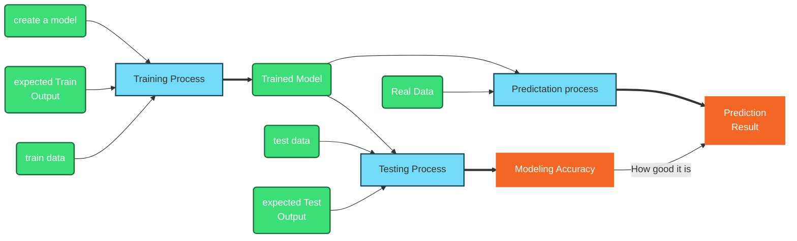

<h1>PyTorch Learning Notes</h1>

## Getting Started

1. set local virtual environment (env)
python -m venv env
2. pip install torch

## Errors
❓ not available module

📝 close VS Code, reopen, and run all code from the top.
## AI on Fashion

28X28=784 input, 2 modle layer,  0-9 output
$$f_{l+1} = \sigma (w_l a_l + b_l) $$
$w_l$: weight for layer l
$b_l$: bias for layer l
$sigma$: activation function
$f_{l+1}$: l+1 function of layer l
the purpose of modeling is find each $w_l$ and $b_l$


* [tensor basics](torchBasics.ipynb)

* [Load data from network, Understand image data, and squeeze(), transpose()](../src/fashion01.py)
* [create model based on all images, and save model into a file](../src/fashion02.py)
* [load model from file, and predict a given image](../src/fashion03.py)



## Homework
* create model for handwriting digits.
```py
train_dataset = datasets.MNIST('data/MNIST_data/', download=True, train=True, transform=ToTensor())
test_data = datasets.MNIST('data/MNIST_data/', download=True, train=False, transform=ToTensor())

```

* [Understand weight in linear function](../src/weight.py)
* [Understand ReLU activate function](../src/relu.py)

## backpropagation
* [wikipedia Backpropagation Explain](https://en.wikipedia.org/wiki/Backpropagation)