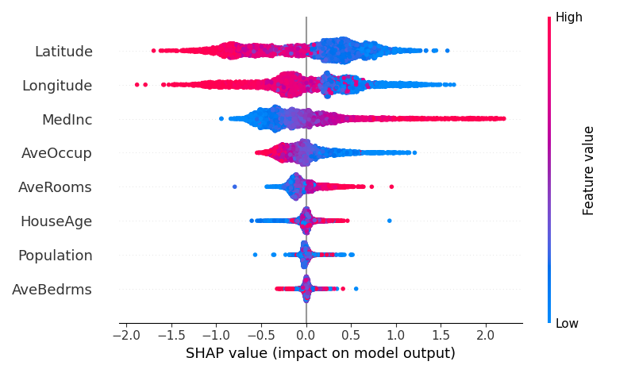
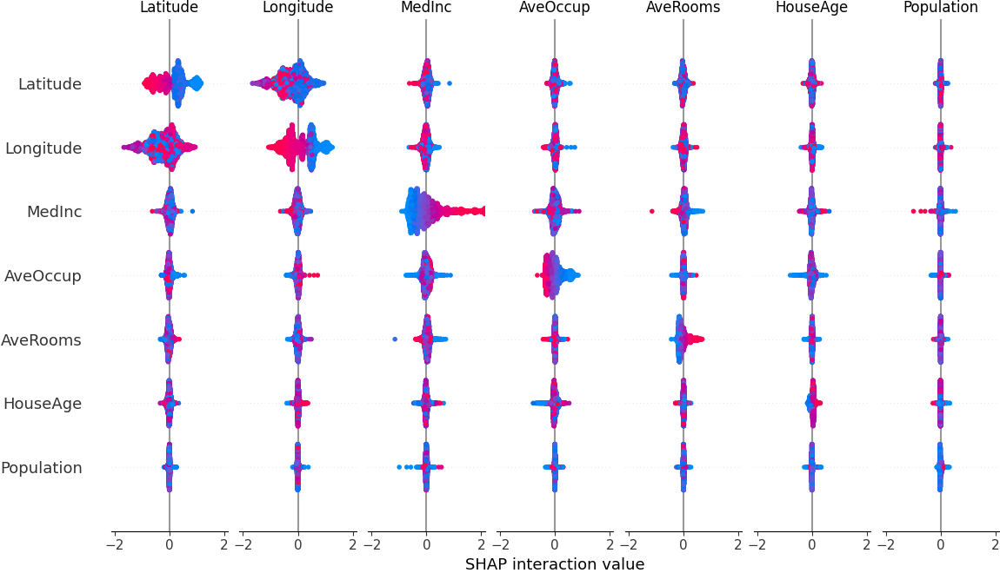
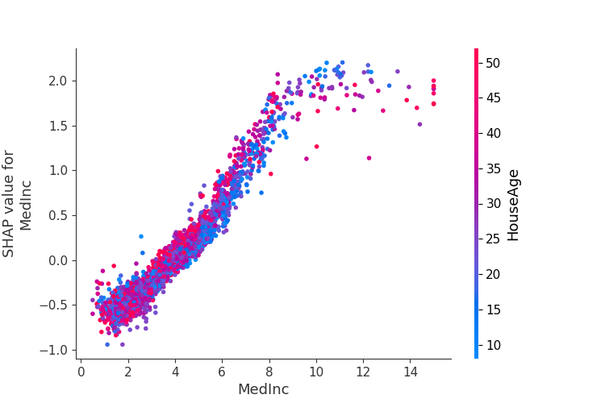

## is it possible to write sample python code to test SHAP by using given well known data?

Yes, you can easily test SHAP with well-known datasets like the Boston housing dataset or California housing dataset from `sklearn`. Here’s a sample Python code using the **California housing dataset** to demonstrate how SHAP works with a regression model:

```python
import shap
import xgboost as xgb
import numpy as np
import pandas as pd
from sklearn.model_selection import train_test_split
from sklearn.datasets import fetch_california_housing

# Load the California housing dataset
california_housing = fetch_california_housing(as_frame=True)
X = california_housing.data
y = california_housing.target

# Split the dataset into training and testing sets
X_train, X_test, y_train, y_test = train_test_split(X, y, test_size=0.2, random_state=42)

# Train an XGBoost regression model
model = xgb.XGBRegressor(objective='reg:squarederror')
model.fit(X_train, y_train)

# Create a SHAP explainer
explainer = shap.Explainer(model)

# Compute SHAP values for the test set
shap_values = explainer(X_test)

# Extract SHAP values and feature names
shap_values_matrix = shap_values.values
feature_names = shap_values.feature_names

# Compute the mean absolute SHAP values for each feature
mean_abs_shap_values = np.abs(shap_values_matrix).mean(axis=0)

# Get the indices of the top 3 features
top_3_indices = np.argsort(mean_abs_shap_values)[-3:]

# Extract the top 3 feature names
top_3_features = np.array(feature_names)[top_3_indices]

# Print the top 3 most important features
print("Top 3 Features:", top_3_features)

# Visualize the SHAP values with a summary plot
shap.summary_plot(shap_values, X_test)

# Compute SHAP interaction values (optional)
shap_interaction_values = explainer.shap_interaction_values(X_test)

# Plot an interaction summary plot
shap.summary_plot(shap_interaction_values, X_test)

# Plot a dependence plot with interaction between two features
shap.dependence_plot(0, shap_interaction_values, X_test, interaction_index=1)
```

### Explanation:
1. **Dataset**: We use the `fetch_california_housing` dataset, a well-known regression dataset available in `sklearn`.
2. **Model**: We train an XGBoost regressor model on the training data.
3. **SHAP Explainer**: The SHAP explainer is created using the trained model, and SHAP values are computed for the test set.
4. **Top Features**: We compute the mean absolute SHAP values for each feature and extract the top 3 most important features based on their SHAP values.
5. **Visualization**:
   - A **summary plot** shows the global importance of features.
   - An **interaction summary plot** displays how features interact globally.
   - A **dependence plot** shows how two specific features interact.

This will allow you to test SHAP and understand the importance of features in the regression task using a well-known dataset.

* [California Housing, well known features](../src/california_housing.py)




## explain the plot
The **SHAP summary plot** provides a comprehensive overview of how different features in your dataset influence the model’s predictions. Here's how to interpret the key elements of the plot:

### Key Elements of the SHAP Summary Plot:

1. **Vertical Axis (Features)**:
   - Each point on the plot corresponds to a specific feature in your dataset.
   - The features are sorted in order of **importance** from top to bottom. The topmost feature is the most important one based on its average SHAP value across all samples.

2. **Horizontal Axis (SHAP Values)**:
   - The **SHAP value** represents the impact of the feature on the prediction for each data point.
   - A positive SHAP value means that the feature **increases** the predicted target (e.g., it pushes the prediction higher).
   - A negative SHAP value means that the feature **decreases** the predicted target (e.g., it pulls the prediction lower).
   - The further a point is from 0 on the horizontal axis, the more significant the impact of that feature on the prediction.

3. **Color of Points**:
   - The color of each point indicates the value of the feature for a specific data point.
     - **Red points** indicate higher feature values.
     - **Blue points** indicate lower feature values.
   - For example, if you see a red point on the far right for a feature, it means that a higher value of that feature increased the prediction.

4. **Spread of Points**:
   - The spread of points across the horizontal axis shows how much the feature's SHAP values vary across different data points.
   - A wider spread indicates that the feature has a larger impact on predictions for some data points but a smaller impact for others.

### Interpretation of the SHAP Summary Plot:

1. **Feature Importance**:
   - Features at the top are the most important. For example, in the California housing dataset, `MedInc` (Median Income) is often the most important feature, meaning it has the most significant influence on house price predictions.
   
2. **Direction of Influence**:
   - If a feature’s SHAP values are mostly positive, it typically **increases** predictions. For example, higher `MedInc` values (red points) might push the prediction for house price upwards.
   - If a feature's SHAP values are mostly negative, it generally **decreases** predictions. For example, if the blue points for `MedInc` are on the left, it indicates lower median incomes tend to lower the predicted house prices.

3. **Feature Effects**:
   - The color gradient (red to blue) helps you see how feature values relate to SHAP values. For instance, if high `MedInc` (red) correlates with higher SHAP values (towards the right), it means that higher income leads to higher predicted house prices.
   - Conversely, if high values of a feature (red) are mostly on the left side, it means those higher feature values **decrease** the model’s predictions.

### Example Insights from a SHAP Summary Plot:
- **`MedInc` (Median Income)**:
  - Likely the most important feature.
  - Red (higher income) pushes the predictions higher, while blue (lower income) pushes them down. This shows that houses in higher-income areas are predicted to have higher prices.
  
- **`Longitude` and `Latitude`**:
  - Geographical features such as `Longitude` and `Latitude` might have a mixed impact, with both positive and negative SHAP values. This can indicate complex geographical pricing effects, such as higher prices in certain regions and lower prices in others.

In short, the SHAP summary plot provides an intuitive view of feature importance, how each feature affects the model’s predictions, and whether higher or lower values of each feature push predictions higher or lower.

## why larger latitude feature value push the prediction to lower prices? 

In the context of the **California Housing Dataset**, the reason that **larger latitude values** push the prediction to lower prices can be explained by California's geography and housing market dynamics.

### Geographic Meaning of Latitude in California:
- **Latitude** measures the distance north or south of the equator. In California, smaller latitude values (closer to 32°N) correspond to **southern regions** like San Diego, while larger latitude values (closer to 42°N) correspond to **northern regions**, such as Northern California.
  
- **Southern California** includes major urban areas like **Los Angeles** and **San Diego**, where housing prices tend to be higher due to:
  - High demand and limited supply of housing.
  - Desirable climate and proximity to beaches.
  - Economic hubs with higher wages, leading to increased affordability.

- **Northern California**, particularly as you move away from the San Francisco Bay Area, tends to have **lower housing prices**. This is because:
  - Many areas in Northern California are more rural or suburban, with less population density and demand for housing.
  - There are fewer large urban centers compared to Southern California.
  - While the **San Francisco Bay Area** (which lies at mid-range latitude) has very high housing prices, as you move further north, prices generally decrease.

### SHAP Interpretation:
- **Larger latitude values** (which represent regions further north in California) likely correspond to areas with lower population density, less economic activity, and fewer high-paying jobs, which leads to lower housing prices.
  
- On the SHAP summary plot, **larger latitude values (red points on the right)** likely push the predictions lower because these northern regions, on average, have lower real estate values compared to the southern part of the state.

### Why the Model Learns This Pattern:
- The model is identifying a trend in the data: as the latitude increases (i.e., moving further north), housing prices tend to be lower on average, which is captured in the negative SHAP values for higher latitude.

In summary, **larger latitude values correspond to more northern locations in California**, where housing tends to be more affordable, and hence the model learns to reduce price predictions for these regions.

## how to explain SHAP values?

SHAP (SHapley Additive exPlanations) values are a popular method to explain the output of machine learning models, especially in complex, non-linear models like tree-based models (e.g., XGBoost, Random Forest). SHAP values provide a way to understand how individual features contribute to a model's prediction.

### Key Concepts of SHAP Values:

1. **Additive Feature Importance**:
   - SHAP values break down a prediction into the contributions of each feature.
   - The sum of all SHAP values (along with the model's base value) equals the model's prediction for a given instance.
   
2. **Shapley Values (from Game Theory)**:
   - SHAP values are based on the concept of Shapley values from cooperative game theory. In this analogy, each feature is like a "player" contributing to the "game" of making a prediction, and SHAP values fairly distribute the "payout" (i.e., the prediction) among the features.
   - The Shapley value for a feature is the average contribution that feature makes to the prediction when considered in all possible subsets of the other features.

### How to Interpret SHAP Values:

1. **Base Value**:
   - This is the average prediction over the training data. It represents the model's output when no features are considered.
   - For example, in a regression problem, the base value might be the mean target value of the training set.

2. **SHAP Value of a Feature**:
   - A positive SHAP value means the feature pushes the prediction **up** (i.e., it increases the model's predicted output for that instance).
   - A negative SHAP value means the feature pushes the prediction **down** (i.e., it decreases the model's predicted output for that instance).

3. **Global vs. Local Interpretability**:
   - **Global Importance**: By averaging the absolute SHAP values across the dataset, you can rank the overall importance of features (global interpretability).
   - **Local Explanation**: For a single prediction, you can see how each feature's SHAP value contributes to that specific instance (local interpretability).

### Example of Explaining SHAP Values:

#### Global Interpretation (Summary Plot):
A **summary plot** shows the overall importance and direction of influence for each feature across the entire dataset.
- **Horizontal axis**: SHAP values (contribution to the prediction). The further a point is from zero, the more influence that feature has.
- **Vertical axis**: Features, sorted by importance (features with higher mean absolute SHAP values are higher).
- **Color**: The color shows the feature's value (e.g., red for high and blue for low values). This allows you to see how feature values affect the predictions (e.g., high values push the prediction up).

#### Local Interpretation (Force Plot):
A **force plot** provides a breakdown of a single prediction.
- **Base value**: The model's expected prediction (e.g., the mean prediction across the training data).
- **Prediction value**: The actual model prediction for this instance.
- **Feature contributions**: Arrows pointing towards or away from the base value show how each feature's SHAP value pushes the prediction higher or lower. The length of the arrow shows the magnitude of that contribution.

### Example in Action:

#### 1. **Global SHAP Summary Plot**:
```python
shap.summary_plot(shap_values, X_test)
```
This plot would display:
- The most important features across the dataset, like `MedInc` (Median Income) in the California Housing dataset.
- How these features influence predictions, such as whether higher `MedInc` values push prices up.

#### 2. **Local SHAP Force Plot**:
```python
shap.force_plot(explainer.expected_value, shap_values[0,:], X_test.iloc[0,:])
```
This would explain the specific prediction for the first instance in `X_test`:
- You would see how each feature (e.g., `MedInc`, `Longitude`, `Latitude`) contributed to the prediction for this particular house price.

### SHAP Summary:
- **Positive SHAP Value**: The feature increases the prediction compared to the base value.
- **Negative SHAP Value**: The feature decreases the prediction compared to the base value.
- **Magnitude**: The size of the SHAP value indicates how much that feature contributes to the prediction.

SHAP values thus provide a highly interpretable and theoretically sound method to explain complex models.

## bollinger band
Bollinger Bands are a popular technical analysis tool used to analyze the volatility and potential price movements of a financial asset, such as stocks. Developed by John Bollinger, these bands consist of three lines plotted in relation to a security’s price: a simple moving average (SMA) and two bands that represent standard deviations above and below the SMA. They help traders identify overbought or oversold conditions and potential trend reversals.

### Components of Bollinger Bands:

1. **Middle Band (SMA)**:
   - This is typically a 20-period **simple moving average** (SMA) of the asset’s price. It serves as the base for the upper and lower bands.
   - Formula:
     \[
     \text{SMA} = \frac{\sum P_{\text{close}}}{n}
     \]
     Where:
     - \( P_{\text{close}} \) is the closing price of each day.
     - \( n \) is the number of periods (e.g., 20 days).

2. **Upper Band**:
   - This is the SMA plus a certain number of **standard deviations** (usually 2) from the SMA.
   - Formula:
     \[
     \text{Upper Band} = \text{SMA} + (k \times \sigma)
     \]
     Where:
     - \( \sigma \) is the standard deviation of the price over the last \( n \) periods.
     - \( k \) is the multiplier, usually set to 2.

3. **Lower Band**:
   - This is the SMA minus the same number of standard deviations from the SMA.
   - Formula:
     \[
     \text{Lower Band} = \text{SMA} - (k \times \sigma)
     \]

### Interpretation:

1. **Volatility Indicator**:
   - When the bands are **narrow**, it indicates low volatility, and when they are **wider**, it indicates high volatility.
   - Volatility tends to revert to the mean, so periods of low volatility are often followed by periods of high volatility, and vice versa.

2. **Price Movements**:
   - **When the price touches or moves above the upper band**, the asset might be considered overbought, and a correction or pullback could occur.
   - **When the price touches or moves below the lower band**, the asset might be considered oversold, signaling a potential buying opportunity.

3. **Squeeze**:
   - A "Bollinger Band Squeeze" occurs when the bands contract significantly due to reduced volatility. This often precedes a period of increased volatility and potential price breakouts (either upward or downward).

4. **Breakouts**:
   - Price breakouts from the bands are often seen as signals of strong future price movements. However, Bollinger Bands do not predict the **direction** of the movement—only the volatility.

### Bollinger Band Strategy Example:
A simple strategy using Bollinger Bands might involve:
- **Buying when the price touches or falls below the lower band** (oversold conditions).
- **Selling when the price touches or rises above the upper band** (overbought conditions).
- Alternatively, traders may look for price breakouts and trade in the direction of the breakout once confirmed by other indicators.

### Python Implementation Example (Using `pandas` and `numpy`):

```python
import pandas as pd
import numpy as np

def bollinger_bands(df, window=20, num_std=2):
    """
    Calculate Bollinger Bands for the given DataFrame.
    
    Parameters:
    df (pd.DataFrame): The stock price data with a 'Close' column.
    window (int): The number of periods for the moving average.
    num_std (int): Number of standard deviations for the bands.
    
    Returns:
    pd.DataFrame: Original DataFrame with Bollinger Bands columns added.
    """
    # Calculate the Simple Moving Average (SMA)
    df['SMA'] = df['Close'].rolling(window=window).mean()
    
    # Calculate the rolling standard deviation
    df['std'] = df['Close'].rolling(window=window).std()
    
    # Calculate the upper and lower bands
    df['Upper Band'] = df['SMA'] + (num_std * df['std'])
    df['Lower Band'] = df['SMA'] - (num_std * df['std'])
    
    return df

# Example usage
# Assuming 'df' is your stock DataFrame with a 'Close' price column
df_with_bands = bollinger_bands(df)
```

### Summary:
- **Bollinger Bands** consist of a middle SMA, an upper band (SMA + 2 standard deviations), and a lower band (SMA - 2 standard deviations).
- They are used to assess market volatility and identify potential overbought or oversold conditions.
- Price breakouts from the bands often signal future volatility, but they do not predict the direction of the movement.

