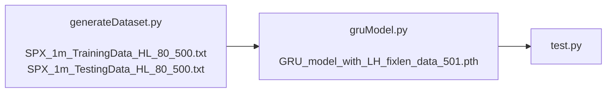
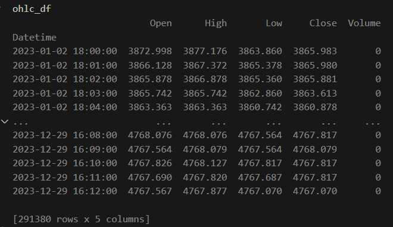
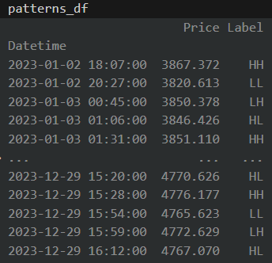
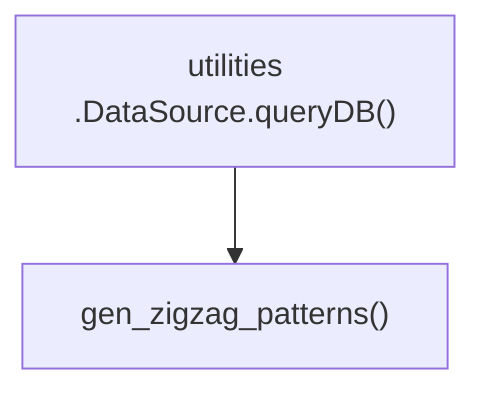
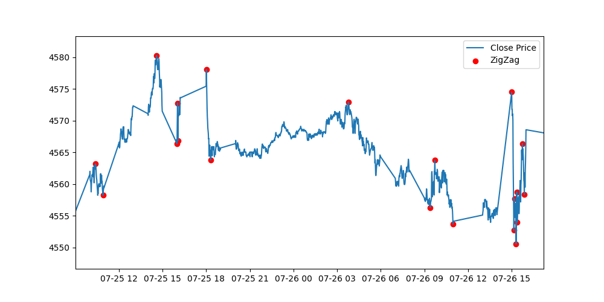
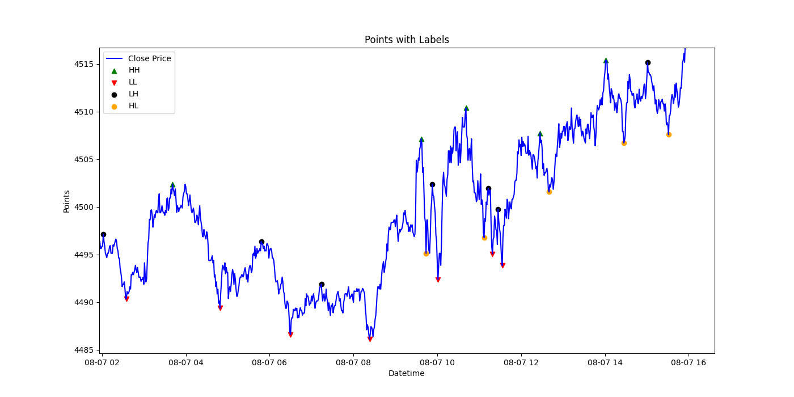

<h1> GRU Action Forecast</h1>



## Table of Contents
- [Table of Contents](#table-of-contents)
- [Todo](#todo)
- [Generate Dataset](#generate-dataset)
  - [Output files](#output-files)
  - [Input](#input)
  - [Output](#output)
- [Create GRU Model](#create-gru-model)
  - [Input](#input-1)
  - [Output](#output-1)
- [Test the model](#test-the-model)
  - [Input](#input-2)
  - [Output](#output-2)

## Todo
1. ~~change trainning data format~~
2. ~~all global variables should read from a configuration file~~
3. ~~optimize Debug~~
4. ~~optimize logging~~
5. clean code make all definitions at begining
6.  ~~separate plot function from data process code~~
7. 🛠🎯use class
8. send Test output to a file for future reference
9. read output prediction data, find out accuracy
10. get rid of zigzagplus1.py
11. read any line of dataset, plot it on screen


## Generate Dataset
* [Define Logger class for whole project](../src/gru.py)
* [Define global variables in cofig.ini](../src/config.ini)
* [load global variables from cofig.ini](../src/config.py)
* [Generate dataset Source Code](../src/generateDataset.py)

```py
def gen_zigzag_patterns(query_start, query_end):
  ... ...
  return ohlc_df, patterns_df
```





* [generate plots](../src/utilities.py)



### Output files
1. [traning dataset](../data/SPX_1m_TrainingData_HL_80_500.txt)
2. [testing dataset](../data/SPX_1m_TestingData_HL_80_500.txt)

* 5 column data group
1. day of weeek
2. time of day
3. close price
4. velocity
5. accelerat

* first column
1=long
0=short

total 60 points end by long/short point for each row which will be total of 5X60=300 numbers

### Input
SQLite database file: [data/stock_bigdata_2019-2023.db]

### Output

* [Trainning Dataset](/data/SPX_1m_TrainingData_HL_80_500.txt)
* [Testing Dataset](/data/SPX_1m_TestingData_HL_80_500.txt)

## Create GRU Model
* [Generate GRU Action Forecast model](../src/gruModel.py)

### Input
* [Trainning Dataset](/data/SPX_1m_TrainingData_HL_80_500.txt)
* [Testing Dataset](/data/SPX_1m_TestingData_HL_80_500.txt)

### Output
* [/GRU_model_with_LH_fixlen_data_501.pth](/GRU_model_with_LH_fixlen_data_501.pth)

## Test the model
* [Test model get R-Square and MSE](../src/test.py)
  
### Input
* [/GRU_model_with_LH_fixlen_data_501.pth](/GRU_model_with_LH_fixlen_data_501.pth)

### Output

```txt
Current date and time: 2024-09-23 09:36:55
1. Load testing data from data/SPX_1m_TestingData_HL_80_500.txt
Data shape: (1684, 80, 5)
Targets shape: (1684, 1)
2. Define dataset and dataloader
Current date and time: 2024-09-23 09:36:56
3. Instantiate the model, define the loss function and the optimize
Current date and time: 2024-09-23 09:36:56
Number of layers: 5
3. Load trained model from GRU_model_with_LH_fixlen_data_501.pth
4. Start testing loop
Current date and time: 2024-09-23 09:36:56
Test Loss (MSE): 0.00353319
Mean Absolute Error (MAE): 0.02026430
R-squared (R2): 0.99644500
Current date and time: 2024-09-23 09:36:58
Saved categorized signals to file : data/SPX_1m_HL_80_500_GRU_fixlen_500.txt
Current date and time: 2024-09-23 09:36:59
```

* [data/SPX_1m_HL_80_500_GRU_fixlen_500.txt](/data/SPX_1m_HL_80_500_GRU_fixlen_500.txt)