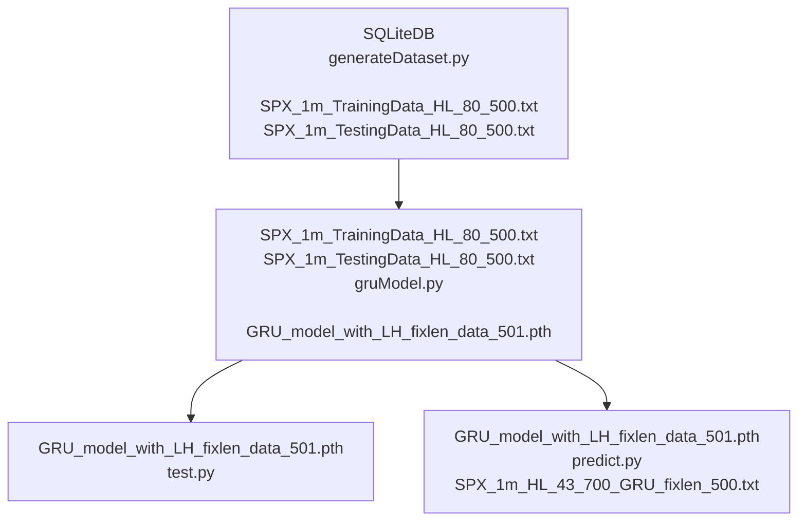

<h1> GRU Action Forecast</h1>



## Table of Contents
- [Table of Contents](#table-of-contents)
- [Todo](#todo)
- [Generate Dataset](#generate-dataset)
  - [Input](#input)
  - [Output files](#output-files)
- [Create GRU Model](#create-gru-model)
  - [Input](#input-1)
  - [Output](#output)
- [Test the model](#test-the-model)
  - [Input](#input-2)
  - [Output](#output-1)
- [Predict using the model](#predict-using-the-model)
  - [input](#input-3)
  - [output](#output-2)

## Todo
1. ~~change trainning data format~~
2. ~~all global variables should read from a configuration file~~
3. ~~optimize Debug~~
4. ~~optimize logging~~
5. ~~clean code make all definitions at begining~~
6.  ~~separate plot function from data process code~~
7. ~~🛠🎯use class~~
8. ~~send Test output to a file for future reference~~
9. train and test data should be the same other than start/end date
10. read output prediction data, find out accuracy
11. get rid of zigzagplus1.py
12. read any line of dataset, plot it on screen
13. write unit test for all functions and classes
14. write tool to check generated dataset


## Generate Dataset
* [Define Logger class for whole project](../src/logger.py)
* [Define global variables in cofig.ini](../src/config.ini)
* [load global variables from cofig.ini](../src/config.py)

* [Generate dataset Source Code](../src/generateDataset.py)

```py
def gen_zigzag_patterns(query_start, query_end):
  ... ...
  return ohlc_df, patterns_df
```


* [generate plots](../src/utilities.py)


✏️☝️Need explaination of above image, ❓How to generate buy/sell points based on the image above☝️❓ Better to have plot to support.

### Input
SQLite database file: [data/stock_bigdata_2019-2023.db]

### Output files
1. [traning dataset](../data/SPX_1m_TrainingData_HL_80_500.txt)
2. [testing dataset](../data/SPX_1m_TestingData_HL_80_500.txt)

* 5 column data feature group
1. day of weeek
2. time of day
3. close price
4. velocity
5. accelerat

* first column
1=long
-1=short

total 60 points end by long/short point for each row which will be total of 5X60=300 numbers


[add macd data to data feature group](macd2example.ipynb)

```dos
pip install sqlalchemy
pip install pandas_ta
```
💡👉 pay attention:
1. Before sending data to train the model, ensure that all columns are appropriately weighted.（工具）
2. plot close price, macd, macdh, macds in same chart, draw square window of a slice. (工具)
3. randomly plot any slice, ensure the datas are in correct position（工具）
4. randomly plot any slice, ensure the datas show some walking patterns（工具）
5. When making slice decisions, refer to the MACD histogram data？（老邢经验）
6. 观察当MACD histogram data 变化最大时，close price的变化(工具)
7. 是否应该将weekday，time，vilocity，accelerate，MACD的数据和RSI的数据统统作切片内的归一化，然后对MACD，Price进行加权
8. 对price，MACD histogram进行指数加权
9. 不能在切片内作平滑和计算速度加速度，应该取所有数据至少作9点平滑以后，再计算峰谷、速度、加速度。不平滑的数据很难准确确定峰谷位置。


🔔⚡️Hold position: 大的zigzag峰谷作为买卖点，峰与谷之间的小峰小谷作为hold点。

## Create GRU Model
* [Generate GRU Action Forecast model](../src/gruModel.py)

### Input
* [Trainning Dataset](/data/SPX_1m_TrainingData_HL_80_500.txt)
* [Testing Dataset](/data/SPX_1m_TestingData_HL_80_500.txt)

### Output
* [/GRU_model_with_LH_fixlen_data_501.pth](/GRU_model_with_LH_fixlen_data_501.pth)

## Test the model
* [Test model get R-Square and MSE](../src/test.py)
  
### Input
* [/GRU_model_with_LH_fixlen_data_501.pth](/GRU_model_with_LH_fixlen_data_501.pth)

### Output

```txt
2024-09-24 11:13:37,788 - gru - INFO - 1. Load testing data from data/SPX_1m_TestingData_HL_80_500.txt
2024-09-24 11:13:39,398 - gru - INFO - Data shape: (1684, 80, 5)
2024-09-24 11:13:39,398 - gru - INFO - Targets shape: (1684, 1)
2024-09-24 11:13:39,398 - gru - INFO - 2. Define dataset and dataloader
2024-09-24 11:13:39,399 - gru - INFO - 3. Instantiate the model, define the loss function and the optimize
2024-09-24 11:13:39,399 - gru - INFO - Number of layers: 5
2024-09-24 11:13:39,400 - gru - INFO - 4. Load trained model from models/GRU_model_with_LH_fixlen_data_500.pth
2024-09-24 11:13:39,405 - gru - INFO - 5. Start testing loop
2024-09-24 11:13:41,524 - gru - INFO - Test Loss (MSE): 0.00309951
2024-09-24 11:13:41,526 - gru - INFO - Mean Absolute Error (MAE): 0.01776317
2024-09-24 11:13:41,526 - gru - INFO - R-squared (R2): 0.99687991
2024-09-24 11:13:41,629 - gru - INFO - Saved categorized signals to file : data/SPX_1m_HL_43_700_GRU_fixlen_500.txt
2024-09-24 11:13:41,629 - gru - INFO - Execution time of test(): 2.2243 seconds
2024-09-24 11:13:41,629 - gru - INFO - ================================= Done

```

* [data/SPX_1m_HL_80_500_GRU_fixlen_500.txt](/data/SPX_1m_HL_80_500_GRU_fixlen_500.txt)

## Predict using the model

* [predict from testing data by using previous generated model that saved in a file](../src/predict.py)

### input
* [the model file name is defined in config.ini](/models/GRU_model_with_LH_fixlen_data_500.pth)
* [the test data file name is defined in config.ini](/data/SPX_1m_TestingData_HL_80_500.txt)

### output
* [the predict result file name is defined in config.ini](/data/SPX_1m_HL_43_700_GRU_fixlen_500.txt)

```txt
Target[1.] : Output[0.9852] -> Signal[1.0]
Target[1.] : Output[0.9828] -> Signal[1.0]
Target[1.] : Output[0.9788] -> Signal[1.0]
Target[1.] : Output[0.9798] -> Signal[1.0]
Target[1.] : Output[0.9942] -> Signal[1.0]
Target[1.] : Output[0.9789] -> Signal[1.0]
Target[1.] : Output[0.9650] -> Signal[1.0]
Target[1.] : Output[0.9837] -> Signal[1.0]
... ...
```

```
2024-09-24 10:31:19,875 - gru - INFO - 1. Load testing data from data/SPX_1m_TestingData_HL_80_500.txt
2024-09-24 10:31:21,394 - gru - INFO - Data shape: (1684, 80, 5)
2024-09-24 10:31:21,394 - gru - INFO - Targets shape: (1684, 1)
2024-09-24 10:31:21,394 - gru - INFO - 2. Define dataset and dataloader
2024-09-24 10:31:21,394 - gru - INFO - 3. Instantiate the model, define the loss function and the optimize
2024-09-24 10:31:21,394 - gru - INFO - Number of layers: 5
2024-09-24 10:31:21,394 - gru - INFO - 4. Load trained model from models/GRU_model_with_LH_fixlen_data_500.pth
2024-09-24 10:31:21,394 - gru - INFO - 5. Start testing loop
2024-09-24 10:31:21,394 - gru - INFO - Randomly selected 10 rows and their corresponding outputs:
2024-09-24 10:31:21,418 - gru - INFO - Test Output:  1.0135 => Categorized Output:  1.0, 	Target:  1
2024-09-24 10:31:21,421 - gru - INFO - Test Output: -1.0031 => Categorized Output: -1.0, 	Target: -1
2024-09-24 10:31:21,435 - gru - INFO - Test Output: -1.0092 => Categorized Output: -1.0, 	Target: -1
2024-09-24 10:31:21,449 - gru - INFO - Test Output:  1.0013 => Categorized Output:  1.0, 	Target:  1
2024-09-24 10:31:21,466 - gru - INFO - Test Output: -0.9915 => Categorized Output: -1.0, 	Target: -1
2024-09-24 10:31:21,477 - gru - INFO - Test Output: -1.0087 => Categorized Output: -1.0, 	Target: -1
2024-09-24 10:31:21,483 - gru - INFO - Test Output: -1.0060 => Categorized Output: -1.0, 	Target: -1
2024-09-24 10:31:21,499 - gru - INFO - Test Output: -0.9803 => Categorized Output: -1.0, 	Target: -1
2024-09-24 10:31:21,501 - gru - INFO - Test Output: -1.0313 => Categorized Output: -1.0, 	Target: -1
2024-09-24 10:31:21,516 - gru - INFO - Test Output:  1.0100 => Categorized Output:  1.0, 	Target:  1
2024-09-24 10:31:21,534 - gru - INFO - Test Output: -0.9957 => Categorized Output: -1.0, 	Target: -1
2024-09-24 10:31:21,538 - gru - INFO - Test Output:  0.9820 => Categorized Output:  1.0, 	Target:  1
2024-09-24 10:31:21,551 - gru - INFO - Test Output: -1.0023 => Categorized Output: -1.0, 	Target: -1
2024-09-24 10:31:21,566 - gru - INFO - Test Output:  0.9771 => Categorized Output:  1.0, 	Target:  1
2024-09-24 10:31:21,583 - gru - INFO - Test Output:  1.0199 => Categorized Output:  1.0, 	Target:  1
2024-09-24 10:31:21,583 - gru - INFO - Test Output: -1.0413 => Categorized Output: -1.0, 	Target: -1
2024-09-24 10:31:21,603 - gru - INFO - Test Output:  0.9827 => Categorized Output:  1.0, 	Target:  1
2024-09-24 10:31:21,617 - gru - INFO - Test Output:  0.9888 => Categorized Output:  1.0, 	Target:  1
2024-09-24 10:31:21,632 - gru - INFO - Test Output:  1.0297 => Categorized Output:  1.0, 	Target:  1
2024-09-24 10:31:21,637 - gru - INFO - Test Output: -1.0142 => Categorized Output: -1.0, 	Target: -1
2024-09-24 10:31:21,637 - gru - INFO - ================================= Done
```